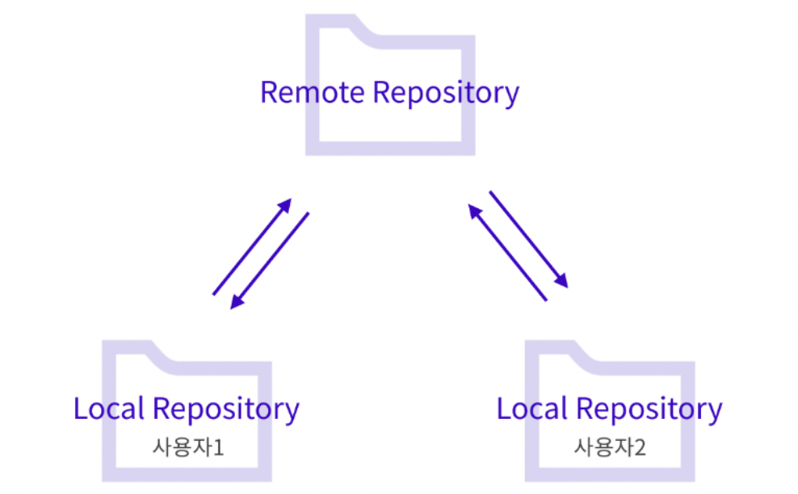

Git : 소스 코드 기록을 관리하고 추적할 수 있는 버전 관리 시스템
Github : Git Repository를 관리할 수 있는 클라우드 기반 서비스

 

Remote Repository : 원격 온라인 서버 상의 저장소(여러사람이 함께 공유가능)
Local Repository : 내 컴퓨터의 저장소(내 개인 전용 저장소)

Repository

Fork : 원격 저장소를 내 원격 저장소로 가지고 오는 작업

Fork
Clone : 나의 Remote Repository에서 내 컴퓨터로 가져오는 작업

Clone
Push :  변경된 내용을 commit을 통해 저장해 준 뒤, Remote Repository에 반대로 올려주는 작업

Pull request : 내가 제안한 코드 변경사항에 대해 반영 여부를 요청

Push
Pull : Remote Repository에서 변경 사항이 있을 때 Local Repository로 가져오는 Pull 작업

Pull
