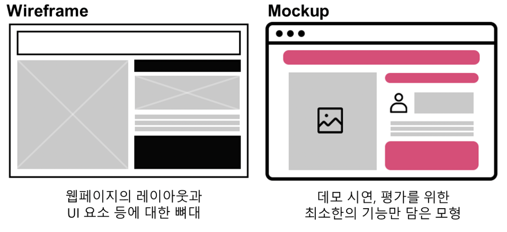
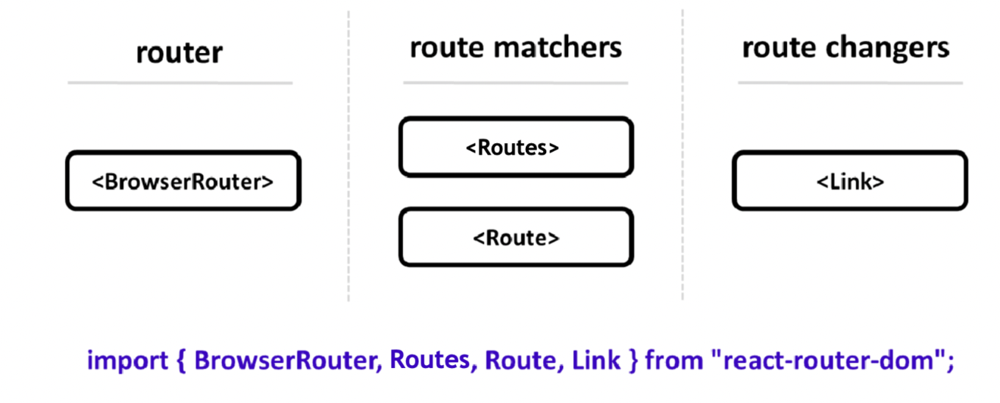
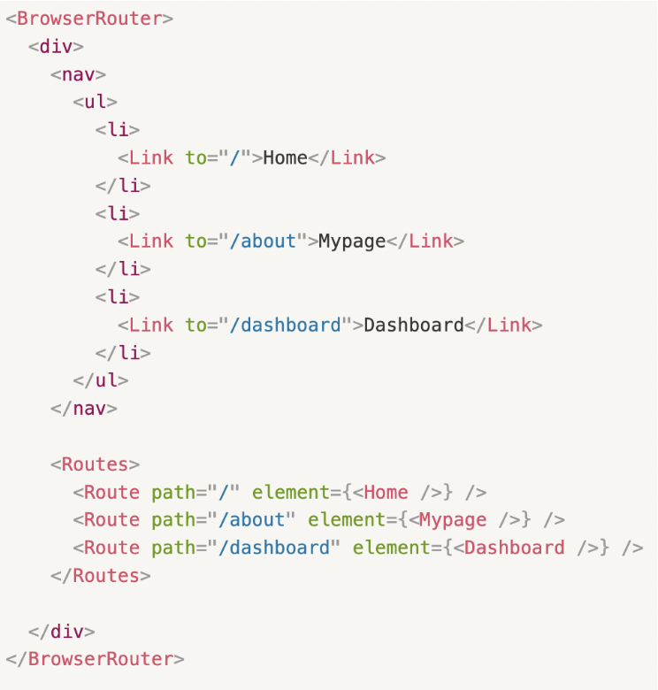

**SPA(Single Page Application)**  
전통적인 웹사이트는 페이지 전체를 로딩하고, SPA는 Menu와 Footer와 같이 페이지 전환 전후에 중복되는 부분은 새로 불러오지 않는다.  
SPA는 서버로부터 완전히 새로운 페이지를 불러오는 것이 아니라, 화면을 업데이트하기 위해 필요한 데이터만 서버에서 전달받아 브라우저에서 해당하는 부분만 업데이트하는 방식으로 작동하는 웹 애플리케이션이나 웹 사이트를 말한다.

**Wireframe과 Mockup**  

  

컴포넌트들끼리 보다 유기적으로 주고받을 수 있도록 설계해야 함

**React Router**

Routing : 다른 주소에 따라 다른 뷰를 보여주는 과정을 경로에 따라 변경한다라는 의미  
React SPA에서는 라우팅을 위해 React Router라는 라이브러리를 가장 많이 사용

주요 컴포넌트  

- BrowserRouter : 라우터 역할

- Routes : 경로를 매칭해주는 역할

- Route : 경로를 매칭해주는 역할

- Link : 경로를 변경하는 역할

  
React Router 사용 환경 세팅

