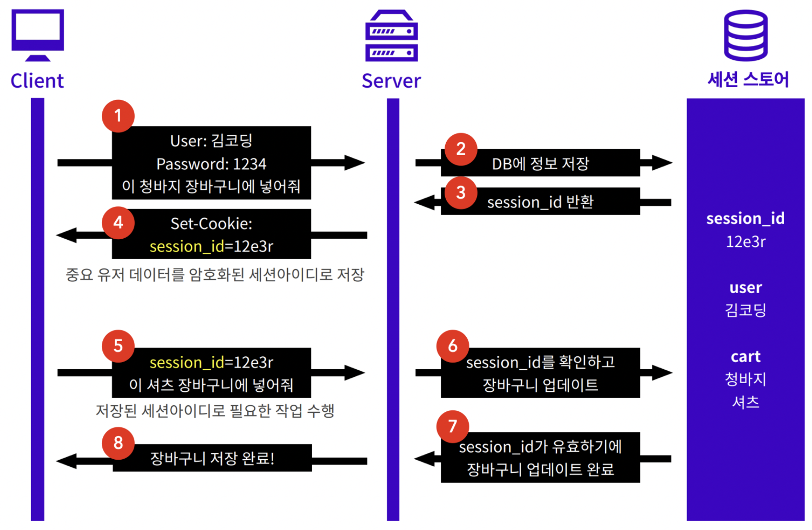

## Session

### 세션기반 인증(Session-based Authentication)

#### 로그인

사용자가 만일 정확한 아이디와 비밀번호를 입력했다면, 서버는 인증(Authentication)에 성공했다고 판단한다. 그렇다면 다음번에 인증을 필요로 하는 작업을 요청할 경우 서버는 아이디 및 비밀번호의 해시를 이미 알고 있기 때문에 "인증에 성공했음"을 서버가 알고 있다면 매번 로그인 할 필요가 없게 된다.

인증에 따라 리소스의 접근 권한(Authorization)이 달라진다.

이때 서버와 클라이언트에 각각 필요한 것이 다음과 같다.

- 서버는 사용자가 인증에 성공했음을 알고 있어야 한다.
- 클라이언트는 인증 성공을 증명할 수단을 갖고 있어야 한다.
- 사용자가 인증에 성공한 상태는 세션이라고 부른다.
  - 서버는 일종의 저장소에 세션을 저장한다. 주로 in-memory, 또는 세션스토어에 저장한다.
- 세션이 만들어지면 각 세션을 구분할 수 있는 세션 아이디도 만들어지는데 보통 클라리언트에 세션 성공을 증명할 수단으로써 세션 아이디를 전달한다.

**이때 웹사이트에서 로그인인을 유지하기 위한 수단으로 쿠키를 사용한다. -> 쿠키에는 서버에서 바급한 세션 아이디를 저장한다.**

쿠키를 통해 유효한 세션 아이디가 서버에 전달되고, 세션 스토어에 해당 세션이 존재한다면 서버는 해당 요청에 접근 가능하다고 판단한다.

하지만 쿠키에 세션 아이디 정보가 없는 경우, 서버는 해당 요청이 인증되지 않았음을 알려준다.

#### 로그아웃

세션 아이디가 담긴 쿠키는 클라리언트에 저장되어 있으며, 서버는 세션을 저장하고 있다. 서버는 그저 세션 아이디로만 요청을 판단한다.

주의 : 쿠키는 세션 아이디, 즉 인증 성공에 대한 증명을 갖고 있으므로, 탈취될 경우 서버는 해당 요청이 인증된 사용자의 요청이라고 판단한다. 이것이 우리가 공공 PC에서 로그아웃해야 하는 이유이다.

로그아웃은 다음 두가지 작업을 해야한다.

- 서버의 세션 정보를 삭제해야 한다.
- 클라이언트의 쿠키를 갱신해야 한다.

서버가 클라이언트의 쿠키를 임의로 삭제할 수는 없다. 대신, set-cookie로 세션 아이디의 키값을 무효한 값으로 갱신해야 한다.

#### express-session

세션을 관리해주는 모듈

Express-session은 세션을 위한 미들웨어로, express에서 세션을 다룰 수 있는 공간을 보다 쉽게 만든다.

또한 필요한 경우 세션 아이디를 쿠키에 저장하고, 해당 세션 아이디에 종속되는 고유한 세션 객체를 서버 메모리에 저장한다. 이때 세션 객체는 서로 독립적인 객체이므로 각각 다른 데이터를 저장할 수 있다.

req.session이 세션 객체이며 req.session은 세션 객체에 세션 데이터를 저장하거나 불러오기 위해 사용한다.

이 세션 객체에 값을 담거나, 값을 불러오는 법, 세션을 파괴하는 법은 문서 참고

[express-session](https://github.com/expressjs/session#reqsession)