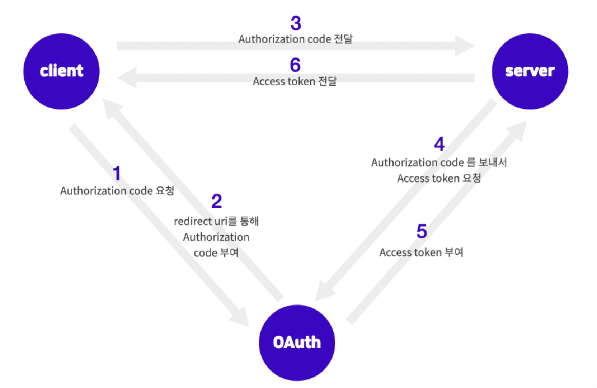

## OAuth 2.0

전통적으로 직접 작성한 서버에서 인증을 처리해주는 것과는 달리, OAuth는 인증을 중개해주는 메커니즘이다. 보안된 리소스에 액세스하기 위해 클라이언트에게 권한을 제공하는 프로세스를 단순화하는 프로토콜이다.  
즉 이미 사용자 정보를 가지고 있는 웹 서비스에서 사용자의 인증을 대신해주고, 접근 권한에 대한 토큰을 발급한 후, 이를 이용해 내 서버에서 인증이 가능해진다.

OAuth가 모든 것을 해결해주는 솔루션은 아니다. 여전히 사용자 정보가 내 서버에 저장되는 것은 변함이 없으며 OAuth는 인증(Authentication)을 다른 서비스에 맡길 뿐, 접근 권한 관리(Authorization)는 순전히 서버의 몫이다.

### OAuth란?

OAuth 2.0은 인증을 위한 표준 프로토콜의 한 종류

보안된 리소스에 액세스하기 위해 클라이언트에게 권한을 제공(Authorization)하는 프로세스를 단순화하는 프로토콜 중 한 방법이다.

### OAuth는 언제, 왜 쓸까

유저 입장에서 보면 우리는 웹상에서 굉장히 많은 서비스를 이용하고 있고 각각의 서비스들을 이용하기 위해서는 회원가입 절차가 필요한 경우가 대부분이다. 그 서비스별로 정보를 다 기억하는 것은 매우 귀찮다.

OAuth를 활용하면 자주 사용하고 중요한 서비스들의 ID와 Password만 기억해 놓고 해당 서비스들을 통해서 소셜 로그인을 할 수 있다.

뿐만 아니라 OAuth는 보안상의 이점도 있다. 검증되지 않은 App에서 OAuth를 사용하여 로그인한다면 직접 유저의 민감한 정보가 App에 노출될 일이 없고 인증 권한에 대한 허가를 미리 유저에게 구해야하기 때문에 더 안전하게 사용할 수 있다.

### OAuth 용어

- Resource Owner : 액세스 중인 리소스의 유저이다. 김코딩의 구글 계정을 이용하여 App에 로그인할 경우, 이때 Resource owner은 김코딩이 된다.
- Client : Resource owner를 대신하여 보호된 리소스에 액세스하는 응용프로그램이다. 클라이언트는 서버, 데스크탑 모바일 또는 기타 장치에서 호스팅할 수 있다.
- Resource server : client의 요청을 수락하고 응답할 수 있는 서버다.
- Authorization server : Resource server가 액세스 토큰을 발급받는 서버이다. 즉 클라이언트 및 리소스 소유자를 성공적으로 인증한 후 액세스 토큰을 발급하는 서버를 말한다.
- Authorization grant : 클라이언트가 액세스 토큰을 얻을 때 사용하는 자격 증명의 유형이다.
- Authorization code : access token을 발급받기 전에 필요한 cod이다. client id로 이 code를 받아온 후, client secret과 code를 이용해 Access token을 받아온다.
- Access token : 보호된 리소스에 액세스하는데 사용되는 credentials이다. Authorization code와 client secret을 이용해 받아온 이 Access token으로 이제 resource server에 접근을 할 수 있다.

### 소셜 로그인 로직 플로우

