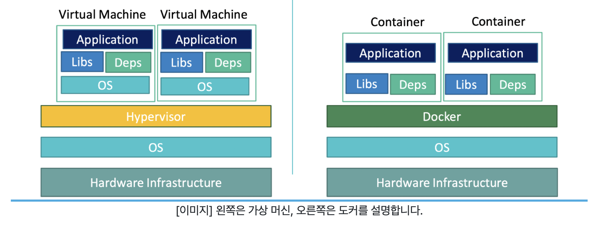

---

layout: single
title: "[컨테이너] Docker CLI"
categories: docker
tag: [docker]
toc: true

---

## Docker

도커는(Docker)는 리눅스 컨테이너(Linux Container) 기술을 기반으로 하는 오픈 소스 서비스이다. 도커를 통해 애플리케이션 실행 환경을 코드로 작성할 수 있으며, OS를 격리화하여 관리한다.

### Linux Container

Linux Container는 Linux 기반의 기술 중 하나로, 필요한 라이브러리와 애플리케이션을 모아서 마치 별도의 서버처럼 구성한 것을 말한다. 컨테이너를 이루는 네트워크 설정, 환경 변수 등의 시스템 자원은 각 컨테이너가 독립적으로 소유하고 있다.

1. 프로세스의 구획화
   - 특정 컨테이너에서 작동하는 프로세스는 기본적으로 그 컨테이너 안에서만 액세스 할 수 있다.
   - 컨테이너 안에서 실행되는 프로세스는 다른 컨테이너의 프로세스에게 영향을 줄 수 없다.
2. 네트워크의 구획화
   - 기본으로 컨테이너 하나에 IP 주소가 할당되어 있다.
3. 파일 시스템의 구획화
   - 컨테이너 안에서 사용되는 파일 시스템은 구획화되어 있다. 그래서 해당 컨테이너에서의 명령이나 파일 등의 액세스를 제한할 수 있다.

### Docker의 문제 해결 CASE

#### CASE 1 - 환경 표준화

대표적인 운영체제(OS)는 Linux, Windows, MacOS로 구분할 수 있다. 그리고 엔지니어는 자신이 개발하는 애플리케이션이 어떤 환경에서 구동될지 생각하고 개발해야 한다. 그리고 개발하려고 하는 여러 애플리케이션을 구동하는 운영체제가 서로 다르다면 환경에 따라 조금씩 변경할 부분이 발생한다. 같은 Linux인 Ubuntu, CentOS, Debian은 서로 다른 환경이므로 여러 버전이 존재할 수 있다.

환경이 다르다면 개발자들이 조정할 문제가 수도 없이 생기며, 수작업으로 환경을 맞추는 일은 쉬운일이 아니다.

#### CASE 2 - 수작업으로 일치시키는 환경 구성

모든 개발자와 사용자가 동일한 OS환경을 유지하는 경우, 어느 정도는 빨라질 수 있다. 예를 들어 OS를 Windows로 지정해서 개발자와 사용자가 항상 같은 OS(Windows)를 사용한다고 가정한다. 그럼 각기 다른 OS를 고려한 빌드 및 테스트 시간은 줄일 수 있을 것이다.

개발된 애플리케이션은 내 컴퓨터에 설치해 사용하고자 할때, '내 컴퓨터' 혹은 '내 사용 목적'에만 맞는 설정이 따로 필요할 수 있다. 예를 들어 환경 변수처럼 같은 OS라도 사용자에 따라 달라지는 구성이 있다.

예를 들어 홈 디렉토리는 사용자마다 다를 수 있다. 홈 디렉토리가 다르듯 애플리케이션을 설치할 때, 컴퓨터의 환경에 맞게 변경해야하는 부분이 있다. 방화벽 설정, 사용자 권한 설정, Port 설정 등이 이런 부분에 해당한다. 그리고 컴퓨터에 다양한 설정 작업을 수작업으로 하게 된다면, 많은 시간이 걸릴 뿐만 아니라 설정 간에 간섭이 일어나 프로그램이 멈출 수도 있다.

고전적인 해결방법으로는 OS를 포맷하고 다시 설치하는 것이다. 그리고 다른 해결방법으로는 개발과 실행에 대한 환경 설정을 코드로 정해두는 것이다.

#### CASE 3 - 리소스 격리성

실제로 하나의 컴퓨터를 사용하지만, 여러개의 컴퓨터를 이용하는 것처럼 하는 방법을 ''리소스 격리성''이라고 한다. 리소스 격리성을 제공하는 기술로는 가상 머신(Virtual Machine), 도커 등이 있다.
<center>

</center>
##### 도커와 가상 머신의 차이

- 도커는 가상 머신만큼 견고한 격리성을 제공하지 않는다.
- 도커는 리눅스의 컨테이너를 이용한 기술로 OS위에 다른 OS를 실행하는 것이 아니므로 가상 머신보다 좋은 성능을 낼 수 있다.
- 애플리케이션에 대한 환경 격리성을 중심으로 한 VM과는 달리, 도커는 Container의 관점에서 개발자와 사용자 커뮤니티를 중심으로 혜택을 제공하는데 있다.



하이퍼바이저 : VM을 생성하고 구동하는 소프트웨어 (VMware, VirtualBox)

왼쪽의 VM의 구성요소에 OS가 존재하는데 비해, 오른쪽의 도커 컨테이너에는 OS를 포함하고 있지 않다. 다만, 도커라는 플랫폼 위에 컨테이너들이 올라가 있고, 그 아래 호스트 OS가 존재한다.

이를 통해, 각 컨테이너는 호스트 OS의 커널(Kernel, 시스템 콜과 같이 OS의 핵심 기능을 구현한 프로그램)을 공유하고 있음을 짐작할 수 있다.

도커는 애플리케이션을 컨테이너화해서 실행하는 데에 주 목적이 있으므로 특별히 컨테이너에 OS를 올려서 사용하지 않는다. 호스트 OS의 입장에서 컨테이너 하나는 프로세스 하나에 불과하다.

**컨테이너에 OS를 올리지않는데 Docker Hub에 존재하는 각종 OS이미지**

잘 알려진 리눅스 배포판인 우분투, CentOS 등은 결국 동일한 리눅스 커널 위에서 만들어진다. 각자가 고유의 디렉토리 구조, 패키지 시스템(apt, yum), 쉘(bash, zsh)등을 사용했을 뿐이다. OS 이미지는 컨테이너 내 애플리케이션 구성의 편의를 위해 존재하는 이미지이다. 우분투, CentOS 이미지를 사용한다고 해도 결코 컨테이너에 커널 수준의 OS가 올라가지 않는다.

**윈도우나 macOS용 도커를 살펴보면 컨테이너 안쪽은 리눅스로 작동된다. 어떻게 컨테이너안에서 리눅스 기반으로 작동?**

윈도우나 macOS는 근본적으로 리눅스 커널을 쓰고 있지 않으므로, 해당 운영체제의 경우 리눅스 커널을 VM의 형태로 실행시키는 하이퍼바이저를 자체적으로 구동한다. 윈도우용 또는 macOS용 도커는 하이퍼바이저 위의 리눅스 커널을 사용하는 것이다.

한가지 재밌는것은 윈도우용 도커는 윈도우 커널을 사용한 윈도우 전용 컨테이너를 실행할 수 있는 기능을 제공한다. 컨테이너는 커널을 공유하므로, 윈도우 커널을 사용하는 컨테이너는 리눅스용 도커에서 사용할 수 없다.

##### Docker Container Lifecycle
<center>

</center>
도커 컨테이너의 독립적인 특징을 기반으로 한 Lifecycle이 있다. 위 그림을 살펴보면, 컨테이너의 생성, 실행, 종료의 과정을 이해할 수 있다.


## Docker CLI

[Docker docs](https://docs.docker.com/engine/reference/commandline/container_run/)

도커를 이용하는데 있어서 명령어, 옵션 등 사용법은 문서에서 확인할 수 있다. Docker CLI 관련 정보뿐만 아니라 Docker의 전반적인 사용법과 환경을 구성하는 방법에 대해서도 확인할 수 있다.

- 사용법 : Docker CLI, Docker-Compose CLI, API Reference
- 환경 및 빌드 파일 구성 : DockerFile, Docker-Compose File

### 도커 이용하기
<center>

</center>
#### docker/whalesay

Docker/whalesay는 레지스트리 계정, 레포지토리 이름, 태그 세가지 정보로 구성되어 있다.
<center>

</center>
- 레지스트리(Registry)
  - Docker Hub : [https://hub.docker.com]( https://hub.docker.com)
  - 도커 이미지를 관리하는 공간이다.
  - 특별히 다른것을 지정하지 않는다면, 도커 허브(Docker Hub)를 기본 레지스트리로 설정한다.
  - 레지스트리는 Docker Hub, Private Docker Hub, 회사 내부용 레지스트리 등으로 나뉠 수 있다.
- 레포지토리(Repository)
  - 레지스트리 내에 도커 이미지가 저장되는 공간이다.
  - 이미지 이름이 사용되기도 한다.
  - Github의 레포지토리와 유사
- 태그(Tag)
  - 같은 이미지라고 할지라도 버전 별로 안의 내용이 조금 다를 수 있다.
  - 해당 이미지를 설명하는 버전 정보를 주로 입력한다.
  - 특별히 다른 것을 지정하지 않는다면 latest 태그를 붙인 이미지를 가져온다.

docker/whalesay:latest

- Docker Hub라는 레지스트리에서
- docker 라는 유저가 등록한 whalesay 이미지 혹은 레포지토리에서
- latest 태그를 가진 이미지

[https://heb.docker.com/r/docker/whalesay](Https://heb.docker.com/r/docker/whalesay)

이미지를 받아온다.

```shell
docker image pull docker/whalesay:latest
```

받아온 이미지를 실행한다.
<center>

</center>
```shell
docker container run --name 컨테이너_이름 docker/whalesay:latest cowsay boo
```

- {container} run
  - 컨테이너 실행
- [OPTIONS]
  - --name : 컨테이너의 이름을 할당
- [COMMAND]
  - command는 초기 컨테이너 실행 시 수행되는 명령어이다.
  - cowsay : 컨테이너 실행시 cowsay 명령어를 호출(node를 호출하듯 이용)
- [ARG...]
  - boo : COMMAND 인 cowsay에 넘겨질 파라미터

```shell
docker container ps -a
```

- {container} ps : 컨테이너의 리스트를 출력
- -a : Default로는 실행되는 컨테이너지만 종료된 컨테이너를 포함하여 모든 컨테이너를 출력

```shell
docker container rm 컨테이너_이름
```

- {container} rm : 컨테이너를 지칭해서 삭제. 컨테이너를 명시할 때는 NAMES혹은 CONTAINER ID를 사용


하나의 이미지를 받아와 컨테이너로 실행하고 컨테이너와 롼련된 리소슬 삭제하는 작업까지 수행 - 이 세가지 작업을 한번에 실행

```shell
docker container run --name 컨테이너_이름 --rm docker/whalesay cowsay boo
```

- {container} run : 컨테이너를 실행한다. 이미지가 없다면 이미지를 받아온 뒤 (pull) 실행한다.
- --rm : 컨테이너를 일회성으로 실행한다. 컨테이너가 중지되거나 종료될 때, 컨테이너와 관련된 리소스를 모두 제거한다.

```shell
docker image rm docker/whalesay
```

​	image rm : 지정돈 도커 이미지 삭제

### Copy, Dockerfile

다름 사람이 제공한 도커 이미지를 받아 사용하는 경우, 원하는 모든 기능이 구성되어 있지 않을 수 있다.

로컬에 저장된 파일과 함께 도커 이미지를 이용하는 방식을 설명한다. 또 로컬 파일과 도커 이미지를 연결하는 방법중 CP를 이용해 로컬 파일을 이미지에 복사하고, 팩맨 게임서버를 실행하는 작업을 수행

#### Docker 컨테이너에 파일을 복사하기

앞선 내용에서는 사용할 모든 파일이 하나의 이미지에 구성되어 있고, 그 이미지를 사용하는 방법을 학습하였다. 그러나 게임 서버, 웹 서버와 같이 사용할 도구가 도커 이미지에 모두 구성되어 있지 않은 경우도 있다.

1. 웹 서버는 도커 컨테이너로 실행
2. 웹 서버를 구성하는 파일은 직접 만들거나 가져온 파일 구성

- 장점
  - 서버에 문제가 생기는 것을 호스트와 별개로 파악할 수 있다.
  - 문제가 생긴 서버를 끄고, 마치 공장 초기화를 하듯 도커 이미지로 서버를 재구동할 수 있다.

로컬에 있는 파일과 도커 이미지를 연결하는 방법은 크게 CP(Copy)를 이용하는 방법과 Docker Volume 기능을 이용하는 방법으로 나뉜다.

- CP(Copy) : 호스트와 컨테이너 사이에 파일을 복사(Copy)
- Volume : 호스트와 컨테이너 사이에 공간을 마운트(Mount)

마운트는 저장공간을 다른 장치에서 접근할 수 있도록 경로를 허용해서 마치 하나의 저장공간을 이용하는 것처럼 보이게 하는 작업이다.

##### http 웹서버

사용할 도커 이미지는 httpd(https daemon)이다. https(http daemon)은 Apache HTTP Server를 실행할 수 있는 오픈소스 웹 서버 소프트웨어이다.

- httpd는 /usr/local/apache2/htdocs/ 경로에 웹 서버와 관련된 파일들이 저장되어 있다면, 해당 파일을 기반으로 웹서버가 실행되도록 한다.

1. codestate-beb/pacman-canvas 레포지토리를 클론

```shell
git clone https://github.com/codestates-beb/pacman-canvas
```

2. docker container run 명령어로 httpd를 실행한다.

```shell
docker container run --name 컨테이너_이름 -p 818:80 httpd
```

3. localhost:818 을통해 웹서버가 작동하고 있는지 확인
4. 서버가 정상적으로 연린것을 확인한 후, 새로운 터미널을 열어 docker container cp 명령어로 로컬호스트에 있는 파일을 컨테이너에 전달한다. cp 열령은 앞경로의 파일을 뒤 경로에 복사한다. 그러므로 위치는 pacman-canvas 디렉토리여야 한다.

```shell
docker container cp ./ 컨테이너_이름:/usr/local/apache2/htdocs
```

FAQ

- 컨테이너를 다룰때, 뭔가 제대로 되지 않는다면 docker exec -it 컨테이너_이름 bash 명령어를 통해 컨테이너 내부 터미널로 접속할 수 있다.

#### Docker 이미지 만들기

1. 구동한 Docker Container를 이미지로 만드는 방법

   1. docker container commit 명령 이용

   ```shell
   docker container commit 컨테이너_이름 my_pacman:1.0
   ```

   2. 생성된 이미지를 900포트에서 웹서버로 구동

   ```shell
   docker run --name my_web2 -p 900:80 my_pacman:1.0
   ```

   3. localhost:900에서 확인

2. Docker Image 빌드를 위한 파일인 Dockerfile로 만드는 방법

   - Dockerfile 공식문서 [https://docs.docker.com/engine/reference/builder/](https://docs.docker.com/engine/reference/builder/)

   - Dockerfile은 이미지 파일의 설명서이다

     - Dockerfile로 paceman 이미지 생성

     ```dockerfile
     FROM httpd:2.4 #베이스 이미지를 httpd:2.4로 사용한다.
     COPY ./ /usr/local/apache2/htdocs #호스트의 현재 경로에 있는 파일을 생성할 이미지 /usr/local/apache2/htdocs에 복사
     ```

     - docker build 명령은 Dockerfile로 도커 이미지 파일을 생성한다.

     ```shell
     docker build --tag my_pacman:2.0 . #'.'을 명령어에 꼭 포함
     ```

     생성된 이미지를 이용해 901포트에 웹서버 구동

     ```shell
     docker run --name my_web3 -p 901:80 my_pacman:2.0
     ```

     - localhost:901에서 확인