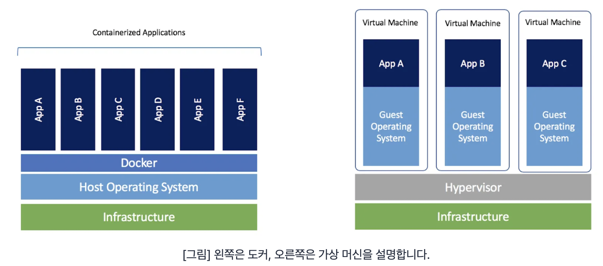
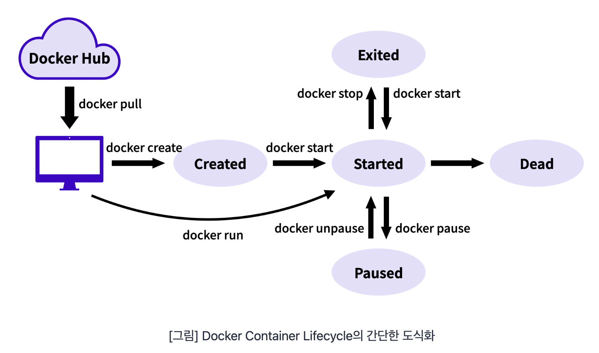

### Docker

도커는(Docker)는 리눅스 컨테이너(Linux Container) 기술을 기반으로 하는 오픈 소스 서비스이다. 도커를 통해 애플리케이션 실행 환경을 코드로 작성할 수 있으며, OS를 격리화하여 관리한다.

#### Linux Container

Linux Container는 Linux 기반의 기술 중 하나로, 필요한 라이브러리와 애플리케이션을 모아서 마치 별도의 서버처럼 구성한 것을 말한다. 컨테이너를 이루는 네트워크 설정, 환경 변수 등의 시스템 자원은 각 컨테이너가 독립적으로 소유하고 있다.

1. 프로세스의 구획화
   - 특정 컨테이너에서 작동하는 프로세스는 기본적으로 그 컨테이너 안에서만 액세스 할 수 있다.
   - 컨테이너 안에서 실행되는 프로세스는 다른 컨테이너의 프로세스에게 영향을 줄 수 없다.
2. 네트워크의 구획화
   - 기본으로 컨테이너 하나에 IP 주소가 할당되어 있다.
3. 파일 시스템의 구획화
   - 컨테이너 안에서 사용되는 파일 시스템은 구획화되어 있다. 그래서 해당 컨테이너에서의 명령이나 파일 등의 액세스를 제한할 수 있다.

#### Docker의 문제 해결 CASE

##### CASE 1 - 환경 표준화

대표적인 운영체제(OS)는 Linux, Windows, MacOS로 구분할 수 있다. 그리고 엔지니어는 자신이 개발하는 애플리케이션이 어떤 환경에서 구동될지 생각하고 개발해야 한다. 그리고 개발하려고 하는 여러 애플리케이션을 구동하는 운영체제가 서로 다르다면 환경에 따라 조금씩 변경할 부분이 발생한다. 같은 Linux인 Ubuntu, CentOS, Debian은 서로 다른 환경이므로 여러 버전이 존재할 수 있다.

환경이 다르다면 개발자들이 조정할 문제가 수도 없이 생기며, 수작업으로 환경을 맞추는 일은 쉬운일이 아니다.

##### CASE 2 - 수작업으로 일치시키는 환경 구성

모든 개발자와 사용자가 동일한 OS환경을 유지하는 경우, 어느 정도는 빨라질 수 있다. 예를 들어 OS를 Windows로 지정해서 개발자와 사용자가 항상 같은 OS(Windows)를 사용한다고 가정한다. 그럼 각기 다른 OS를 고려한 빌드 및 테스트 시간은 줄일 수 있을 것이다.

개발된 애플리케이션은 내 컴퓨터에 설치해 사용하고자 할때, '내 컴퓨터' 혹은 '내 사용 목적'에만 맞는 설정이 따로 필요할 수 있다. 예를 들어 환경 변수처럼 같은 OS라도 사용자에 따라 달라지는 구성이 있다.

예를 들어 홈 디렉토리는 사용자마다 다를 수 있다. 홈 디렉토리가 다르듯 애플리케이션을 설치할 때, 컴퓨터의 환경에 맞게 변경해야하는 부분이 있다. 방화벽 설정, 사용자 권한 설정, Port 설정 등이 이런 부분에 해당한다. 그리고 컴퓨터에 다양한 설정 작업을 수작업으로 하게 된다면, 많은 시간이 걸릴 뿐만 아니라 설정 간에 간섭이 일어나 프로그램이 멈출 수도 있다.

고전적인 해결방법으로는 OS를 포맷하고 다시 설치하는 것이다. 그리고 다른 해결방법으로는 개발과 실행에 대한 환경 설정을 코드로 정해두는 것이다.

##### CASE 3 - 리소스 격리성

실제로 하나의 컴퓨터를 사용하지만, 여러개의 컴퓨터를 이용하는 것처럼 하는 방법을 ''리소스 격리성''이라고 한다. 리소스 격리성을 제공하는 기술로는 가상 머신(Virtual Machine), 도커 등이 있다.

###### 도커와 가상 머신의 차이

- 도커는 가상 머신만큼 견고한 격리성을 제공하지 않는다.
- 도커는 리눅스의 컨테이너를 이용한 기술로 OS위에 다른 OS를 실행하는 것이 아니므로 가상 머신보다 좋은 성능을 낼 수 있다.
- 애플리케이션에 대한 환경 격리성을 중심으로 한 VM과는 달리, 도커는 Container의 관점에서 개발자와 사용자 커뮤니티를 중심으로 혜택을 제공하는데 있다.

#### Docker Container Lifecycle

도커 컨테이너의 독립적인 특징을 기반으로 한 Lifecycle이 있다. 위 그림을 살펴보면, 컨테이너의 생성, 실행, 종료의 과정을 이해할 수 있다.