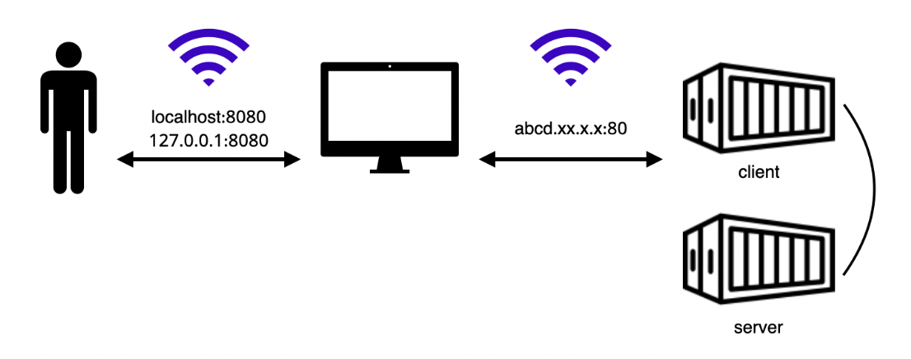

## 두 개의 Docker Image를 다루는 방식 연습

- nginx 이미지를 기반으로 한 sebcontents/client 이미지를 이용하여 client 컨테이너를 생성
- node 이미지를 기반으로 한 sebcontents/server 이미지를 이용하여 server 컨테이너를 생성



- 이번 실습에서는 localhost의 8080번 포트로 접속하면 sebcontents/client 이미지를 이용해 배포한 client 컨테이너의 80번 포트로 연결된다.

### Docker-compose CLI

[Docker compose docs](https://docs.docker.com/compose/reference/)

```shell
docker-compose up # -d 옵션을 함께 사용하면, 컨테이너를 백그라운드로 실행할 수 있다.
```

<center>[커맨드] docker-compose.yaml에 정의된 이미지를 컨테이너로 실행한다.</center>

```shell
docker-compose down 
```

<center>[커맨드] docker-compose.yaml에 정의된 이미지를 이용해 실행된 컨테이너를 종료한다.</center>

```shell
docker-compose up {특정 이미지}
```

<center>[커맨드] 특정 이미지만 컨테이너로 실행한다.</center>

#### client와 server를 동시에 구동

- Docker-compose.yaml
  - yaml, yml 같은 확장자
  - 하나의 docker-compose에서 관리되는 컨테이너끼리는 동일한 docker network에서 구동된다.
    - docker run 명령과 다르게 docker-compose 파일 안에서 기본 network가 사용된다.
  - [Docker compose-file Docs](https://docs.docker.com/compose/compose-file/)

```yaml
version: '3.8'

services:
	nginx:
		image: sebcontents/client
		restart: 'always'
		ports:
			- "8080:80"
		container_name: client
		
	node:
		image: sebcontents/server
		restart: 'always'
		ports:
			- "4999:80"
		container_name: server
```

1. Docker-compose.yaml 혹은 docker-compose.yml 파일을 위의 소스를 그대로 붙여넣어 생성한다. 파일을 생성할 때 터미널의 위치는 무관
2. yaml 파일이 있는 위치에서 docker-compose up -d 명령어를 통해 yaml 파일을 실행한다.