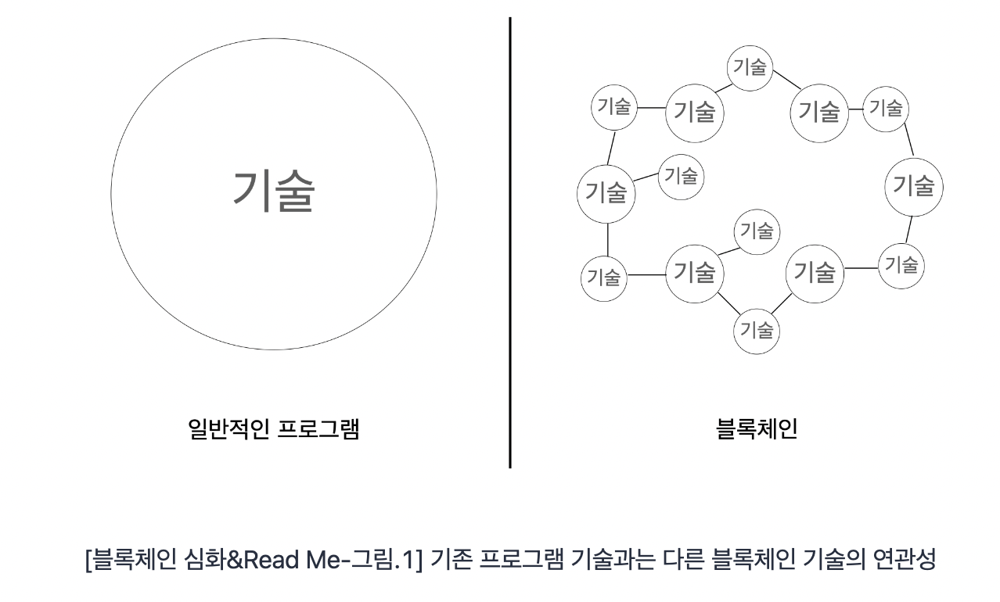
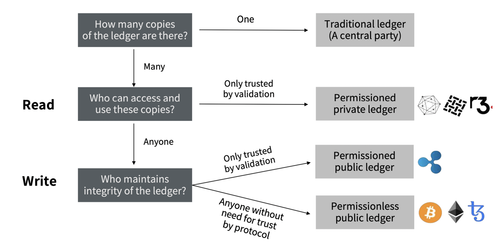
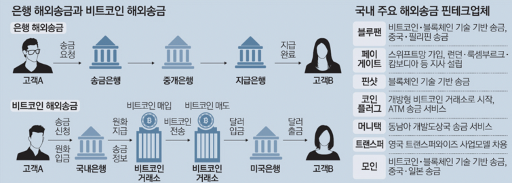
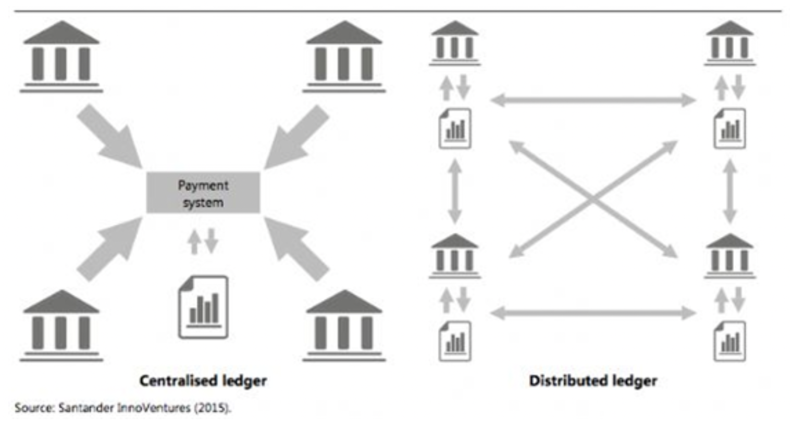

---

layout: single
title: "[블록체인] 블록체인 소개"
categories: blockchain
tag: [blockchain, 분산원장기술, 트랜잭션]
toc: true

---

블록체인이란 P2P(Peer to Peer) 네트워크를 통해서 관리되는 분산 데이터베이스의 한 형태로, 거래 정보를 담은 장부를 중앙 서버 한곳에 저장하는 것이 아닌 블록체인 네트워크에 연결된 여러 컴퓨터에 저장 및 보관하는 기술이다.

블록체인은 제 3의 신용기관 없이도 네트워크 참여자들 간의 신뢰할 수 있는 거래가 가능하게 함으로써 디지털 인프라에 탈중앙화, 수평적인 디지털 비즈니스의 기반이 됩니다. 그렇기에 다양한 산업분야(IT, 금융, 정부, 언론, 의료, 법률 등)에 쓰일 수 있는 잠재력이 있다.

블록체인은 다양한 기술의 집합체이다.

## 공개 범위에 따른 블록체인

### 퍼블릭 블록체인(Public Blockchain)

퍼블릭 블록체인(Public Blockchain)은 개방형 블록체인으로 누구나 트랜잭션(Transaction)을 생성할 수 있는 블록체인이다.  
일반적으로 블록체인이라 하면 이 퍼블릭 블록체인을 지칭한다. 퍼블릭 블록체인은 트랜잭션 내역이 모두에게 공개되어 네트워크에 참여한 모든 노드(Node)가 이를 상호 검증하고 거래를 승인하기 때문에 신뢰도가 높다는 장점이 있다. 하지만 모든 참여자의 거래긹을 남기고 이를 공유하느라 처리 속도가 느리다는 단점이 있다.

### 프라이빗 블록체인(Private Blockchain)

프라이빗 블록체인(Private Blockchain)은 서비스 제공자(기업 또는 기관)의 승인을 받아야만 참여할 수 있으며 주로 기업에서 활용하여 엔터프라이즈 블록체인(Enterprise Blockchain)이라고도 한다.  
리눅스 재단이 이끌고 있는 오픈소스 블록체인 프로젝트인 하이퍼레저(Hyperledger) 역시 프라이빗 블록체인으로 분류된다.

하이퍼레저(Hyperledger)는 스마트 계약을 구현할 수 있는 오픈소스 기반의 프라이빗 블록체인 플랫폼으로 기업 비즈니스를 구현하기에 적합한 환경이지만, 우리가 일반적으로 알고 있는 퍼블릭 블록체인의 탈중앙화와는 다르게 중앙화된 플랫폼이라는 특징이 있다.

### 컨소시엄 블록체인(Consortium Blockchain)

컨소시엄 블록체인(Consortium Blockchain)이란 동일한 목적이나 가치를 가지고 있는 다수의 기업과 단체들이 하나의 컨소시엄을 구성하고 그 안에서 작동하도록 만든 블록체인이다. 대표적으로 리눅스재단이 주도하고 IBM 등이 참여해서 만든 하이퍼레저 패브릭(hyperledger fabric) 프로젝트가 있다.

넓은 의미에서 보면, 컨소시엄 블록체인은 프라이빗 블록체인의 한 형태로 볼 수 있기에, 이를 별도로 구별하여 **하이브리드 블록체인**으로 분류하기도 한다.

**컨소시엄 블록체인**은 하이브리드 블록체인이라는 말처럼 퍼블릭 블록체인과 퍼블릭 블록체인과 프라이빗 블록체인의 중간 형태로, 중앙 관리자에 의해 승인 받은 참여자만이 블록 생성에 참여할 수 있는 프라이빗 블록체인과 유사한 개념이다. 프라이빗 블록체인과는 달리 목적을 가지고 있는 여러 기관이 하나의 컨소시엄을 구성하여 공정성과 확장성을 보완하였다. 따라서 다수 참여자의 협의가 필요한 분야에서는 컨소시엄 블록체인이 프라이빗 블록체인보다 효과적이다. 컨소시엄 블록체인을 이용하면 기관 간에 직접 거래함으로써 제 3자에 대한 거래 수수료를 줄이고 거래 시간을 단축할 수 있다.

| 구분        | 퍼블릭 블록체인                         | 프라이빗 블록체인                                        | 컨소시엄 블록체인                                   |
| ----------- | --------------------------------------- | -------------------------------------------------------- | --------------------------------------------------- |
| 관리자      | 모든 거래 참여자                        | 한 중앙 기관이 모든 권한 보유                            | 컨소시엄에 소속된 참여자                            |
| 거버넌스    | 한번 정해진 법칙을 바꾸기 매우 어려움   | 중앙 기관의 의사결정에 따라 용이하게 법칙을 바꿀 수 있음 | 컨소시엄 참여자들의 합의에 따라 법칙을 바꿀 수 있음 |
| 거래속도    | 네트워크 확장이 어렵고 거래 속도가 느림 | 네트워크 확장이 매우 쉽고 거래속도가 빠름                | 네트워크 확장이 쉽고 거래 속도가 빠름               |
| 데이터 접근 | 누구나 접근 가능                        | 허가받은 사용자만 접근 가능                              | 허가받은 사용자만 접근 가능                         |
| 식별성      | 익명성                                  | 식별 가능                                                | 식별 가능                                           |

### 세계은행그룹(World Bank Group)의 블록체인 구분

## 분산원장기술(DLT; Distributed Ledger Technology)

분산원장(Distributed Ledger)은 **거래 정보를 기록한 원장을 특정 기관의 중앙화된 서버가 아닌 분산화된 네트워크에서 참여자들이 공동으로 기록 및 관리하는 기술**로 공유원장 또는 분산원장기술이라고 한다.  
광범위하게 널리 분포되어 있음을 의미하는 분산(Distributed)과 거래내역이 기록된 장부를 의미하는 원장(Ledger)이 합쳐진 분산 원장은 블록체인 기술의 핵심이다.

기존의 여러 서비스는 중앙집중원장(Centralized Ledger)의 형태를 띄고 있다. 오늘날 여러 대기업에서 제공하는 서비스나 은행시스템을 이용할 수 있었던 것은 그들이 알아서 잘 관리하고 처리해줄 것이라는 신뢰가 뒷받침되어 있기 때문이다. 이러한 기관, 기업에게 신뢰비용(수수료 등)을 지불하고, 그들은 서비스를 제공하며 데이터를 보관(보안)하고 활용했다.

### 중앙집중원장(Centralized Ledger)의 취약점

- 비용문제

  제 3자인 중앙집중형 관리시스템은 거래자들 사이에서 과도한 관리 중개수수료를 청구한다.  
  중앙집중형 시스템은 데이터베이스를 유지, 관리하기 위해 많은 보안유지비용을 지출하며, 금융권의 경우 매년 천문학적인 돈을 보안인프라에 투자하기도 한다. 그 비용은 우리에게 부담되는 것과 같다.

  

- 시간문제

  중앙집중형 관리시스템은 상호거래의 프로세스 전반에 많은 중간다리가 포함되어 있기에 시간과 비용 측면의 효율성이 떨어진다.  
  은행의 경우 각 은행들의 데이터베이스를 통해 거래를 확인하고 청산하기까지 중앙은행과 금융결제원, 외환거래의 경우 더 많은 중간다리가 포함되어 있다. 이렇게 많은 미들맨들이 존재할 경우 프로세스 전반에 걸쳐 시간과 비용이 증가하여 효율성이 떨어진다.

- 보안문제

  중앙 집중형 데이터베이스를 이용하게 되면 해커들의 공격 대상은 오직 하나, 중앙 데이터베이스이다.  
  아무리 보안 유지에 힘을 쓴다 하더라도 해커는 중앙의 데이터베이스 하나만을 목표로 공격하게 되고, 공격에 성공한다면 중앙에 있는 모든 데이터 보안이 뚫리게 된다.

### 분산원장기술의 장점

분산원장기술의 장점은 중앙 집중형 방식에 비해 인증과 증명의 효율성, 시스템 안정성, 보안성, 투명성이다.  
기존 시스템의 경우 데이터 거래 증명을 위해 여러 중간 매개체 또는 인증기관이 필요했지만 분산원장은 사용자가 거래 내역을 직접 공유할 수 있는 시스템이라는 차별성을 갖게 된다.  
이러한 특성 때문에 중앙화된 시스템을 관리시 사용되는 비용이 줄어들고 거래 정보가 분산되어 저장되기 때문에 해킹 및 위조의 위험성도 낮아진다.

### 개인 지갑 사이의 거래

분산원장기술의 장점으로 인해, 개인과 개인이 직접 거래할 수 있다.

중앙기관으로부터 벗어나 거래를 하게 되면, 해외송금에 걸리는 시간이나 비용이 획기적으로 단축된다.  
이로 인해 비용과 시간의 문제가 해결되고, 분산원장기술로 보안문제도 해결한다.

분산원장 기술로 인해 국내외의 물리적 거리나 시간에 구애받지 않고, 언제 어디서든지 거래 상대에게 송금할 수 있다.

## 트랜잭션

블록체인의 블록은 헤더(Header) + 바디(Body)로 이루어져 있고, 헤더(Header)는 **메타데이터**, 바디(Body)는 **트랜잭션들의 리스트**로 구성되어 있다.

블록은 거래의 기록 단위로 다수의 트랜잭션을 포함할 수 있다.

- 이 블록은 체인 중 몇 번째 블록인지
- 이 블록에 몇 개의 트랜잭션이 있는지
- 이 블록을 생성은 누가 했는지
- 이 블록의 크기, 총 전송량 등은 얼마인지

이런 정보들을 메타데이터라고 한다. 블록이라는 데이터를 설명하는 데이터이기 때문이다.  
이 메타 데이터는 블록의 맨 윗 부분에 따로 두는데 이러한 이유로 블록의 메타 데이터를 블록 헤더(Header)라고 부른다.

헤더안의 메타데이터에는 논스(Nonce)값이 있는데 이 논스는 트랜잭션의 논스와는 다른 역할을 한다.

**트랜잭션(Transaction)**이란 **데이터베이스의 상태를 변환시키는 하나의 논리적 기능을 수해하기 위한 작업의 단위**라고 하며, 데이터베이스 트랜잭션이 안전하게 수행된다는 것을 보장하기 위한 성질을 가리키는 약어 A.C.I.D를 통해 트랜잭션의 특성을 알 수 있다.

비트코인에서 거래를 하기 위해선 보내는 주소, 받는 사람의 주소, 금액, 수수료 등의 정보를 작성해야하고, 이렇게 작성된 것이 바로 **트랜잭션 데이터**이다.

블록체인에서의 트랜잭션 역시 상호작용 및 작업 수행의 논리적 단위이다. 블록체인 상의 모든 활동은 트랜잭션을 통해 이루어지고 추상적인 관점에서 트랜잭션은 블록체인의 상태(State) 변화시키는 일련의 작업을 내포하고 있다.

## 비트코인과 이더리움의 트랜잭션 데이터 구조 차이

비트코인과 이더리움의 트랜잭션 데이터 구조는 각각 다음과 같고, 논스(Nonce)의 유무가 가장 큰 차이이다.

### 비트코인 트랜잭션 구조

| 필드            | 설명                                                         |
| --------------- | ------------------------------------------------------------ |
| 버전 번호       | 채굴자와 노드가 트랜잭션 처리에 사용할 규칙을 지정하는데 사용 |
| 입력 카운터     | 트랜잭션에 포함된 입력의 개수                                |
| 입력 리스트     | 블록의 첫 트랜잭션은 코인베이스 트랜잭션(Coinbase Transaction), 입력 리스트에는 하나 이사의 트랜잭션 입력이 포함 |
| 출력 카운터     | 출력의 개수를 나타내는 양의 정수                             |
| 출력 리스트     | 트랜잭션에 포함된 출력                                       |
| 로크(Lock) 시간 | 트랜잭션이 유효해지는 가장 빠른 시간을 정의하는 필드         |

### 이더리움 트랜잭션 구조

| 필드                 | 설명                                                         |
| -------------------- | ------------------------------------------------------------ |
| 논스(Nonce)          | 발신 EOA에 의해 발행되어 메시지 재사용을 방지하는데 사용되는 일련번호 |
| 가스 가격(Gas Price) | 발신자가 지급하는 가스의 가격                                |
| 가스 한도(Gas Limit) | 이 트랜잭션을 위해 구입할 가스의 최대량                      |
| 수신자(Recipient)    | 목적지 이더리움의 주소                                       |
| 값(Value)            | 목적지에 보낼 이더의 양                                      |
| 데이터(Data)         | 가변 길이 바이너리 데이터 페이로드                           |
| v, r, s              | EOA의 ECDSA 디지털 서명의 세가지 구성 요소                   |

이더리움 트랜잭션 논스의 특징

- 거래 전속(Transaction)시 논스는 1씩 증가
- 논스는 계정에서 유일하며, 동일한 논스가 존재하지 않는다.

논스(Nonce)는 발신 주소의 속성이며, 발신 주소의 컨텍스트 안에서만 의미를 갖는다. 그러나 명시적으로 블록체인 계정 상태에 저장되지 않고 해당 주소에서 발생한 확인된 트랜잭션 건수를 세어서 동적으로 계산되는 값이 논스이다.  
논스는 중복되지 않고 순차적이기 때문에, 같은 논스에 여러 트랜잭션 전송이 발생하였다면 해당 논스 중 제일 높은 가스비(Gas Price)를 지불한 트랜잭션이 처리된다. 이더리움에서는 이러한 방법으로 이중 지불 문제를 방지한다.

만약 논스가 0인 트랜잭션 전송 후 논스가 2인 트랜잭션을 전송하면, 두 번째 트랜잭션은 어떤 블록에도 포함되지 않는다. 이더리움 네트워크는 누락된 논스가 나타날 때까지 기다리는 동안 두 번째 논스를 **멤풀(Mempool)**에 저장한다.

**멤풀(Mempool)**이란 아직 블록에 들어가지 않은 상태의 트랜잭션들이 어떤 공간에 있는 것을 의미한다.

그 다음 논스가 1인 누락된 트랜잭션을 전송하면, 두 트랜잭션이 처리가 되고 블록에 포함된다.

비트코인과 이더리움 논스(Nonce)의 유무 차이는 결국, **이중지불(Double Spending)**의 방지를 위해서이다.

**이중지불(Double Spendin)**이란 원본 파일에 저장된 가치를 지불한 뒤, 해당 파일을 복사하여 다른 사람에게 또 지불하는 것을 말한다.

모든 트랜잭션은 일회성이다.그래서 하나의 트랜잭션은 하나의 상태만 변화시킬 수 있다.  
이 문제를 해결하기 위해 비트코인의 경우 UTXO(미사용 트랜잭션 출력값)을 통해 해결하고 이더리움은 어카운트기반 시스템으로 논스값을 각 트랜잭셔이 오직 한번만 처리하게 하는 카운터로 사용한다.  
UTXO와 어카운트 기반의 프로토콜 차이 때문에 이더리움 트랜잭션의 논스가 있고, 이 논스는 트랜잭션을 발신한 사람이 트랜잭션에 필요한 메시지(이더리움 트랜잭션에 필요한 데이터) 재사용을 방지하기 위함이다.