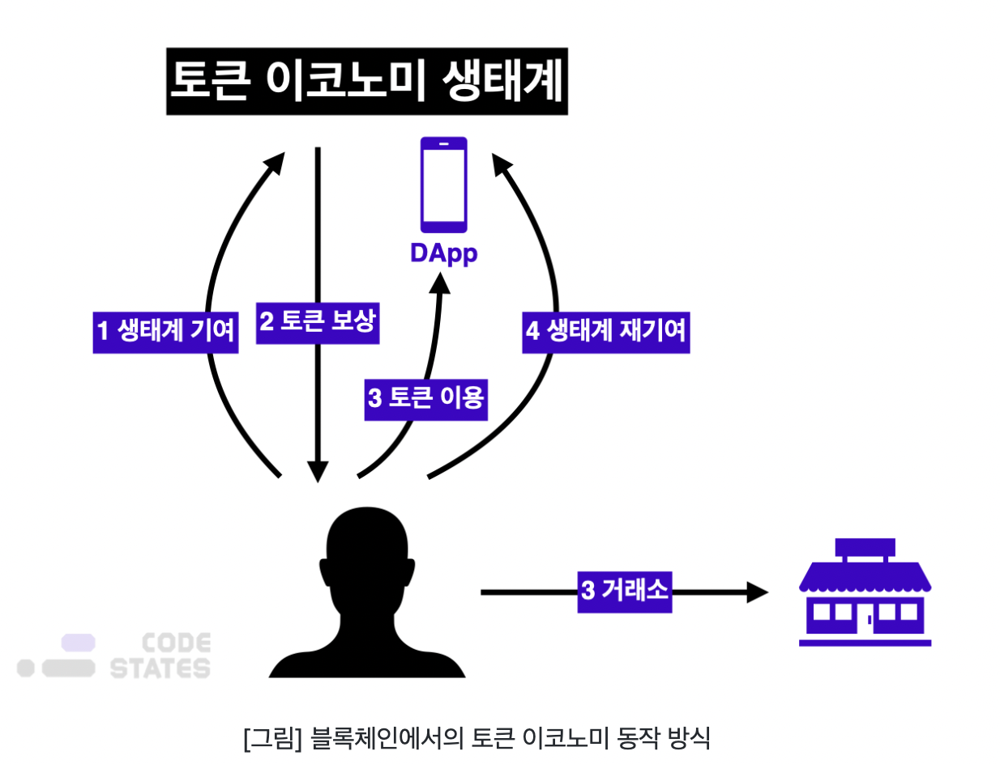

### 코인과 토큰

#### 토큰 발행 방법 - 스마트 컨트랙트

이더리움 블록체인은 비트코인과 다르게, 단순히 코인을 주고받는 것 이외에 아래와 같은 다양한 행위를 할 수도 있습니다.

- 토큰의 발행
- 특정 조건을 만족했을 때, 토큰 전송

이더리움의 "스마트 컨트랙트(Smart Contract)" 기능을 사용해 위와 같은 기능을 구현할 수 있다.

스마트 컨트랙트 직역하면 "똑똑한 계약서"라는 뜻이다.

말 그대로 스마트 컨트랙트는 계약서 이다. 일반적으로 계약서에는 "이 계약의 당사자가 누구인지", "무슨 조건이 있는지", "조건을 만족했을 때 어떤 일을 하는지" 등이 적혀 있다.

스마트 컨트랙트에도 계약의 주체와 조건, 행위 등이 적혀있다. 다만, 스마트 컨트랙트는 한글이나 영어가 아닌 기계가 해석하고 읽을 수 있는 프로그래밍 언어로 적혀있다.

이더리움과 클레이튼에서는 솔리디티(Solidity)라는 프로그래밍 언어를 사용해 스마트 컨트랙트를 작성할 수 있다.

프로그래밍 언어로 적힌 스마트 컨트랙트를 이더리움 네트워크에 배포하면, **누구든지 이 스마트 컨트랙트에 접근하여 함수를 실행할 수 있다.**

가령, 토큰을 발행한다면 다음과 같이 컨트랙트를 작성할 수 있다.

```solidity
contract CozToken {
	
	constructor() {
			_name = "CozToken";
		_totalSupply = 100000000 * E18;
		_balances[msg.sender] = 1000 * E18;
	}
	// 중략 ...
		function mintToken(address recipient, uint256 amount) public {
			if(msg.sender == isOwner()) {
				return _mint(address recipient, uint256 amount);
			}
		}
	// 중략 ...
}
```

CozToken 컨트랙트를 배포하면 constructor 함수가 실행되면서, CozToken이라는 토큰이 생겨난다.

또한 토큰의 총 발행량(_totalSupply)이 정해지고, _balances 변수에 누가 토큰을 얼마나 가졌는지를 저장하게 된다.

누군가가 CozToken 컨트랙트의 mintToken 함수를 실행한다면 먼저 if문을 통해 해당 계약서의 조건을 확인한다. 그리고 계약의 조건이 충족되어 if문을 통과할 수 있다면, _mint 함수를 실행하여 토큰을 발행해준다.

#### 코인과 토큰의 차이

코인과 토큰은 독립된 블록체인 네트워크를 소유하고 있는지(자체 메인넷을 가지고 있는지)에 따라 나뉜다.

##### 법정화폐와 지역화폐

한국의 법정화폐는 대한민국 중앙은행인 한국은행에서 발행하는 화폐이다. 이 화폐는 대한민국 어디서나 법적으로 화폐로 인정된다.

반면 지역화폐는 대한민국 내 특정 지역 내에서 특정 구성원들이 유통하는 화폐를 의미한다. 즉, 지역이나 구성원 등 특정 조건을 만족할 때만 사용할 수 있는 화폐이다.

##### 코인

코인은 블록체인 네트워크에서 발행한다. 가령 비트코인 네트워크에서는 비트코인(BTC)을, 이더리움 네트워크에서는 이더(ETH)를 발행한다.

블록체인 네트워크에서는 코인을 왜 발행할까

블록체인에서 트랜잭션을 블록체인 네트워크에 있는 노드들과 공유하고 합의에 도달하기 위해서는 채굴(mining)이 필요하기 때문이다. 누군가는 네트워크에서 채굴을 해야 블록체인에 트랜잭션이 올라가 기록될 수 있다. 따라서 채굴은 블록체인 네트워크를 활성화하는 필수불가결한 과정이다.

비트코인에서는 채굴을 하고자 하는 노드 중, 가장 먼저 퀴즈를 푸는 노드가 채굴을 할 수 있다. 이더리움의 경우, 네트워크에 가장 많은 코인을 예치(스테이킹, staking)한 노드가 채굴을 할 수 있다.

비트코인에서 채굴을 하기 위해서는 엄청난 양의 컴퓨팅 자원을 소모하며, 이더리움에서 채굴을 할 때는 많은 코인을 네트워크에 묶어두어야 한다. 따라서 채굴이라는 생태계에 기여한 노드에게는 보상을 해주어야 한다.

블록체인 네트워크에서는 **코인을 발행함으로써 채굴 노드에게 보상을 지급**한다.

반면, 토큰은 특정 블록체인 네트워크 위에서 특별한 목적을 가지고 발행된다.

|             | 코인                                                         | 토큰                                               |
| ----------- | ------------------------------------------------------------ | -------------------------------------------------- |
| 발행하는 곳 | 블록체인 네트워크에서 발행한다. 따라서 코인은 독립된 블록체인 네트워크를 가진다. | 특정 플랫폼에서 블록체인 네트워크를 통해 발행한다. |
| 목적        | 채굴에 대한 보상(블록체인 생태계를 활성화)                   | 플랫폼 생태계 활성화                               |

#### 대표적인 토큰
<center>

</center>
이더리움 네트워크 기반 토큰을 발행하는 플랫폼

- 크립토키티
- 브레이브 브라우저
- 컴파운드
- 테더

### 토큰 이코노미

위키피디아에서는 토큰 이코노미를 다음과 같이 정의한다.

> "A token economy is a system of contingency management based on the systematic reunforcement of target behavior. The reinforcers are symbols or **"tokens"** that can be exchanged for other reinforcers. A token economy is based on the principles of operant conditioning and behavioral economics and can be situated within applied behavior analysis"
>
> 토큰 이코노미는 **특정행동의 시스템적인 강화**를 기반으로 둔 우발성 관리 시스템이다. 강화제는 다른 강화제와 교환할 수 있는 상징 또는 토큰이다. 토큰 이코노미는 자발적인 훈련의 원칙과 행동 경제에 기반하고 있으며, 응용 행동 분석에 위치할 수 있다.

쉽게 말해 토큰 이코노미는 어떠한 행동을 끌어내기 위해 '토큰'을 보수로 주고 그 토큰의 유/무형의 가치와 교환됨으로써 그 행동을 강화하는 방법이다.

#### 토큰 이코노미의 3요소

- 토큰

  토큰은 물질적 강화제, 서비스, 또는 구너한 등과 교환될 수 있는 물건이나 상징이다.

- 강화제

  강화제는 특정 행동에 대한 보상으로, 토큰과 교환할 수 있는 것을 의미한다. 강화제는 물건이 될 수 있지만, 무형의 형태일 수도 있다.

- 특정 목표 행동

  토큰 이코노미가 마련된 환경 또는 생태계에서 수행해야 하는 바람직한 행동을 의미한다. 수행자가 특정 목표 행동을 하도록 토큰과 강화제를 통해 유도한다.

#### 기존 토큰 이코노미의 문제점

1. 토큰의 교환가치가 비합리적인 경우
2. 토큰의 발행/지급/기록이 투명하지 않은 경우
3. 토큰의 교환가치 또는 비율에 일관성이 없는 경우
4. 미래 교환가치에 확신이 없는 경우

이런 문제는 토큰의 발행, 지급, 교환가치 주체가 중앙 주체라는 특성 때문이다.

따라서 토큰 시스템의 **지속적인 신뢰성**을 구축하기 위해서는 아주 신뢰도가 높은 관리자를 선정하는 등 투명성을 확보하기 위해 많은 노력을 기울여야 한다.

#### 블록체인에서의 토큰 이코노미

블록체인에서 토큰 이코노미는 블록체인 네트워크 위의 경제 구조 전체를 의미한다.
<center>

</center>
1. 사용자가 토큰 이코노미가 적용된 생태계에 '특정 목표 행동'을 수행하여 생태계에 기여를 한다.
2. 해당 플랫폼에서는 기여에 대한 보상으로 토큰(강화제)을 지급한다.
3. 사용자는 금전적 가치를 지니는 토큰을 다시 생태계 내에서 사용하거나, 혹은 거래소를 통해 거래하여 이득을 취할 수 있다.
4. 여기서 중요한 것은 특정한 행동을 했을때 보상(토큰)을 지급받는다는 점이다. 따라서 사람들은 보상을 얻기 위해 특정 목표행동을 다시 수행하여 생태계에 기여를 하게 된다.

#### 토큰 == 강화제

심리학에서의 토큰 이코노미와는 다르게, 토큰과 강화제가 별개가 아니라, **토큰 그 자체가 금전적인 가치를 지니고, 시장에서 가격이 정해진다**는 차이가 있다.

즉 사용자가 기여한 만큼 받은 토큰 자체에 환금성과 유동성이 있는 것이다. 토큰 자체에 시장이 생기다 보니, 사용자는 이 토큰을 가지고 세가지 액션을 취할 수 있게 된다.

1. 토큰 보유(hold)

   토큰의 생태계가 점점 더 커지고, 사용자가 많아진다면 토큰에 대한 수요도 많아지게 된다. 토큰에 대한 수요가 많아지면, 공급에 비해 수요가 높아지기 때문에 토큰의 가격이 올라가게 된다.

2. 토큰 교환(exchange)

   생태계가 불안전하거나 토큰 이코노미가 견고하지 못한 경우, 토큰 가격이 불안정해질 수 있다. 이 경우 ,사용자는 보유하고 있는 토큰을 비교적 안정적인 화폐로 교환하여 원하는 상품이나 서비스를 구매한다.

3. 토큰 사용(Use)

   해당 토큰을 발행하는 플랫폼에서 생태계를 활성화하기 위해 플랫폼 자체에서 토큰을 사용하도록 할 수도 있다. 또는 사용자가 다른 블록체인 서비스의 토큰과 보유하고 있는 토큰을 교환하여, 해당 블록체인 서비스를 이용할 수도 있다.

#### 블록체인 토큰 이코노미에서 기존의 문제점을 해결

**토큰의 교환가치**

기본적으로 블록체인 기반 토큰 이코노미에서 토큰이자 강화제인 '토큰'의 가치는 시장의 공급과 수요에 의해 정해진다. 따라서 현실의 서비스/재화와의 가치가 합리적일수 밖에 없다.

**블록체인 기술을 활용한 투명성 확보**

블록체인은 한번 기록된 데이터에 대해서는 수정 또는 삭제가 거의 불가능하다는 특징을 갖고 있다. 또한 퍼블릭 블록체인의 경우 모든 거래내역이 공개되어 있어 누구나 거래내역을 확인하고 검증할 수 있다.

**탈중앙화된 토큰 관리 주체**

기존 토큰 이코노미에서는 토큰을 발행하고 관리하는 주체가 중앙화되어 있었다. 이로 인해 중앙 관리 주체가 임의로 토큰 분배 비율을 바꾸거나, 토큰 시스템 자체를 불공평하게 바꿀 수도 있었다. 이로 인해 생태계 참여자들이 토큰을 불신하여 생태계를 떠나버리는 문제가 발생한다.

그러나 블록체인에서는 생태계 참여자들이 합의한 규칙을 스마트 컨트랙트로 만들어 블록체인에 올린다. 누구나 블록체인에 올라간 스마트 컨트랙트를 보고 실행할 수 있기 때문에 공정하면서도 중앙 주체를 신뢰할 필요가 없는 구조가 된다.

#### 블록체인 토큰 이코노미의 목적

블록체인 생태계에서 토큰 이코노미의 목적은 인센티브를 통한 네트워크의 확장이다.

네트워크 확장이라는 목표하에, 토큰 이코노미는 일종의 선순환 구조를 만든다.

블록체인 네트워크는 참여자가 많아질수록 네트워크의 사용성과 범용성이 더 좋아진다. 따라서 네트워크 참여자가 많아져 생태계가 활성화될수록 토큰 자체의 가격이 올라 생태계 참여자는 더 많은 인센티브를 얻게된다.

또한 네트워크 초기에 토큰 가격이 낮을 때 참여하는 사람이 더 많은 인센티브를 얻어갈 가능성이 높다.

우선 네트워크를 구성하고 나면, 사람들은 더 많은 인센티브를 얻기 위해 초기에 네트워크에 참여하기 때문이다.

#### 블록체인 토큰 이코노미를 설계할 때 고려해야 할 것

따라서 네트워크를 확장한다는 목표를 달성하기 위해서는 생태계 참여자들에게 매력적인 인센티브를 제공하는 구조를 만드는 것이 중요하다.

- 보상(토큰)은 어떤 기준으로 어떤 참여자에게 줄것인가
- 어떻게 토큰이 가치를 갖게 할 것인가
- 사람들이 토큰을 보유해야 할 유인은 무엇인가
- 토큰의 발행량은 얼마로 하고 어떻게 분배할 것인가
- 네트워크의 성장과 토큰의 가치 상승을 어떻게 연동할 것인가
- 토큰의 가격 변동성은 어떻게 해결할 것인가

### 체인의 공개 형태에 따른 토큰 시스템

#### 퍼블릭 블록체인의 토큰 이코노미

블록체인에 새로운 생태계를 구성한다는 것은 기존 코인을 가지고 새로운 합의 알고리즘을 추가하거나, 기존 블록체인과는 다른 형태의 수익분배 모델을 만드는 것 등을 의미한다.

하지만 실제로 블록체인 내에 새로운 생태계를 만드는 것은 불가능에 가깝다.

비트코인이나 이더리움은 채굴에 대한 보상으로 코인을 배분한다.  
비트코인이나 이더리움 1.0처럼 작업증명 기반 합의 알고리즘을 사용하는 시스템을 구축해놓은 상태에서, 새로운 합의 알고리즘을 추가하는 것은 매우 어렵다.

그러나 블록체인 위에 스마트 컨트랙트로 발행된 토큰은 독립적인 새로운 생태계를 만들 수 있다.

블록체인 네트워크 안에 포함되어 있으나, 토큰 이코노미를 활용하여 독립적인 인센티브 시스템을 구축할 수 있다. 발행한 토큰을 기존의 다른 암호화폐(코인, 토큰)와 교환할 수 있도록 하거나 토큰을 사용할 수 있는 공간을 제공함으로써 토큰에 가치를 부여할 수 있기 때문이다.

암호화폐 네트워크에서 제공되는 토큰은 같은 네트워크 내에서만 상호 교환할 수 있다. 이러한 동일한 네트워크 내 서로 다른 두 토큰을 교환하는 행위를 "스왑(Swap)"이라고 한다. 스왑은 서로 같은 가치만큼 토큰을 교환하는 형태이다.

블록체인에서의 토큰 이코노미는 사용자들의 합의에 의해 정해진 토큰 기반 경제 시스템이라는 점에서 **프로토콜 이코노미(Protool Economy)**라고도 불린다.

현재 Terra 기반의 ChaiPay(Chai Card)가 퍼블릭 블록체인의 토큰으로써 실물 경제에 직접적인 영향력을 발휘하고 있다.

#### 컨소시엄, 프라이빗 블록체인의 토큰 시스템

컨소시엄 형태 또는 프라이빗 형태의 블록체인은 채굴자가 정해져 있다. 허가받은 사람만 채굴할 수 있고, 채굴하더라도 보상이 없기 때문에, 채굴보다는 블록 생성자에 가깝다.

퍼블릭 블록체인에 비해 컨소시엄과 프라이빗 형태의 블록체인이 가지는 가장 큰 장점은 높은 확장성과 빠른 처리 속도이다.

퍼블릭블록체인 네트워크가 가지는 확장성의 한계로 인해, 토큰 시스템도 그 속도가 제한적일 수 밖에 없다. 그러나 컨소시엄, 프라이빗 블록체인은 탈중앙화와 타협하는 대신, 더욱 빠른 처리 속도의 토큰 시스템을 제공할 수 있다.

그러나 비트코인에서 출발한 블록체인은, 탈중앙화에 큰 가치를 두고 있다. 이 때문에 현재 시장에서는 탈중앙화와 타협한 이런 형태의 토큰 시스템이 환영받지는 못하고 있다.

기업에서 채택하는 블록체인이 항상 컨소시엄이나 프라이빗일 필요는 없다. 마찬가지로 퍼블릭일 필요도 없다. 블록체인의 트릴레마를 고려하여, 제공하려는 서비스에 알맞은 네트워크를 선택하면 된다.