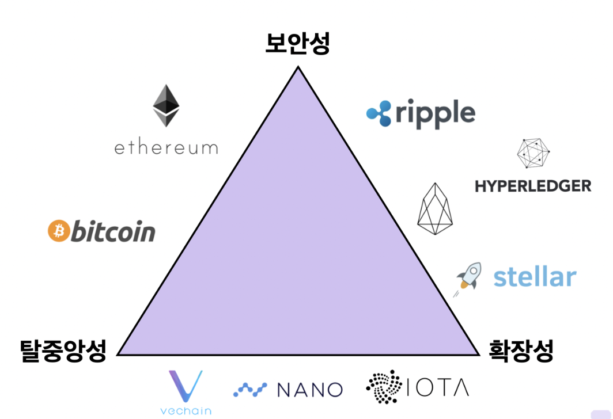

## 블록체인 트릴레마

블록체인은 확장성(Scalability), 보안성(Security), 탈중앙성(Decentralization) 중 하나는 희생해야 하는 문제를 갖고 있다. 이러한 문제를 트릴레마(Trilemma)라고 한다.

딜레마가 둘 사이에서 고민하는 것이라면 트릴레마는 셋 사이에서 고민하는 것이다.

"선택해야 하는 길은 3가지가 되는데 그 어느 쪽을 선택해도 남은 두 가지 또한 한 가지의 문제를 악화시키는 상황"을 말한다.

- 확장성 : 사용자가 늘어나도 유연하게 대응할 수 있는 정도르 나타낸다. TPS(Transaction Per Second)가 높다고도 표현한다.
- 보안성 : 블록체인 내의 데이터나 프로그램을 권한이 없는 이용자가 사용할 수 없도록 제한하여, 외부의 공격으로부터 프로그램을 보호한다.
- 탈중앙성(Decentralization) : 중앙 집권화를 벗어나 분산된 소규모 단위가 모여, 자율적으로 운영되는 방식을 말한다. 블록체인은 기존의 서버-클라이언트 관계가 아니라, 개별 노드들의 자발적이고 자율적인 연결에 의해 P2P방식으로 동작한다.

### 세 요소의 상호작용과 한계

블록체인 네트워크에서 거래를 하기 위해서는 트랜잭션을 전파해서 검증하는 과정이 필요하다.

이때 검증은 모든 노드가 진행하기 때문에 시스템에 노드(참가자)가 많을수록 하나의 계약을 처리하는데 오랜 시간이 걸릴 수 있다.

다시 말해, 많은 노드 수는 탈중앙성을 강화하지만, 확장성을 저하하게 된다.

블록체인 트릴레마가 해결될 수 없는 이유는 세 요소가 모두 비례관계에 있지 않기 때문이다.

이러한 관계성으로 인해 세가지 요소를 동시에 최적화할 수 없으며 상호 간 절충이 필요하다.

### 트릴레마의 대표 우선순위를 둔 코인 예시

#### 장단점

**확장성 중심 네트워크의 장단점**

장점

- 네트워크가 많은 양의 트랜잭션을 지원할 수 있도록 한다.
- 소셜 메시징 애플리케이션과 같이 보안이 주요 초점이 아닌 애플리케이션에서 유용할 수 있다.

단점

- 확장성은 보안을 희생해야 한다.
- 네트워크가 확장됨에 따라 합의 메커니즘도 확장해야 중앙집중화를 벗어날 수 있다.

**보안성 중심 네트워크의 장단점**

장점

- 기존 가치 이전보다 빠르고 저렴한 대규모 가치 이전이 가능하다.
- 퍼블릭 블록체인의 보안은 네트워크 참여자에게서 나온다. 높은 보안은 복제하기 쉽지 않은 높은 네트워크 효과를 의미한다.ㄴ

단점

- 더 많은 자원, 다시 말해 더 많은 투자가 필요하다.

**탈중앙화 네트워크의 장단점**

장점

- 탈중앙화를 통해 사용자가 단일 엔티티를 신회하지 않고도 합의를 유지할 수 있다.
- 분산화는 시스템의 견고성을 증가시키기 때문에 바람직하다.

단점

- 분산화는 지연을 초래하고 네트워크 속도를 늦춘다.
- 중복성을 도입하기 때무네 비용이 많이 들고 모든 애플리케이션에는 바람직하지 않다.

### 레이어의 다양한 해소방안

현실적으로 블록체인 네트워크는 확장성, 보안성, 탈중앙성 3가지 요소 중 2가지 요소만 만족할 수 있다.  
이러한 한계를 극복하고자 블록체인 산업군에서는 레이어 1, 레이어 2 솔루션으로 분류되는 다양한 도전을 하고 있다.

교통체증을 해결하는 방법은  
첫째로, 도로를 넓혀 차선을 추가하는 방법이 있다.  (레이어 1 솔루션)  
둘째로, 추가 도로를 건설하거나 다른 교통수단을 추가하는 방법이 있다.(레이어 2 솔루션)

레이어 1솔루션이 기존에 우리가 알고 있는 블록체인을 개선하는 것을 의미한다면,  
레이어 2솔루션은 이러한 레이어 1의 네트워크 위에서 작동하는 것을 의미한다.

#### 레이어 1(Layer-1) 솔루션

레이어 1은 블록체인 네트워크 그 자체를 의미한다.  
대표적으로 우리가 이미 알고 있는 비트코인, 이더리움과 같은 블록체인 프로토콜을 의미한다.

레이어 1 솔루션은 기존의 블록체인의 규칙 또는 메커니즘을 직접적으로 개선하는 것을 의미한다.

이러한 개선은 대부분 해당 블록체인을 직접적으로 개발하는 코어팀에 의해 도입되는 경우가 많다.

##### 합의 프로토콜 개선

비트코인과 이더리움은 둘다 분산된 합의 프로토콜을 활용한다.  
하나의 트랜잭션을 처리하기 위해 여러 노드의 검증이 필요하고, 대표 블록을 선정하기 위해 수많은 연산이 요구된다.

이러한 과정은 악의적인 공격에 비교적 안전하고, 정확하고 검증된 데이터를 기록할 수 있다는 장점이 있지만, 속도가 느려서 더 많은 수요를 감당할 수 없다.

즉, PoW(작업 증명)은 안전하지만, 확장성이 떨어진다.

그렇기 때문에 많은 블록체인 네트워크가 지분증명(PoS)으로의 전환을 시도하고 있다.  
채굴자가 상당한 컴퓨팅 연산을 사용하여 암호화 알고리즘을 해결하도록 요구하는 PoW대신, PoS 합의 프로토콜은 네트워크 지분을 기반으로 검증인 상태를 결정한다.

이는 이더리움 네트워크의 용량을 극적이고 근본적으로 증가시키는 동시에 탈중앙화를 높이고 보안을 보장할 것으로 예상된다.

##### 샤딩(Sharding)

샤딩은 기존 분산 데이터베이스에서 활용되는 솔루션으로 블록체인에도 도입되었다.

샤딩은 트랜잭션을 샤드라고 하는 더 작은 데이터 세트로 나눈다.

이러한 샤드는 네트워크에서 동시에 병렬로 처리되므로 동시에 수많은 트랜잭션에 대한 순차적 작업이 가능하다.

또한 각 네트워크 노드가 제네시스의 모든 블록 사본을 보유하도록 하는 대신, 서로 다른 노드에 의해 분할되고 유지될 수 있게 하며 각 노드는 그 자체로 일관성을 유지한다.

샤드는 메인체인에 증거를 제공하고 교차 샤드 통신 프로토콜을 사용하여 주소, 잔액 및 일반 상태를 공유하기 위해 상호 작용한다.

#### 레이어 2(Layer-2) 솔루션

레이어 2는 다른 블록체인 위에 구축된 네트워크를 의미한다.  
이는 레이어 1 블록체인 위에서 작동하며 확장성과 효율성을 향상시키는 네트워크 또는 기술을 말한다.

레이어 2 솔루션은 최근 몇 년동안 엄청난 성장을 이룩했으며 특히 PoW 네트워크의 확장성 문제를 극복하는 가장 효율적인 방법을 입증하고 있다.

##### 롤업(Rollup)

롤업은 레이어 1 외부에서 트랜잭션을 실행하지만, 레이어 1에 트랜잭션 데이터를 저장하는 방식이다.  
롤업은 레이어 1 블록체인의 보안성은 건들지 않으면서도 확장성을 강화할 수 있다는 장점이 있다.

롤업의 동작 방식

1. 레이어 1 외부에서 트랜잭션 실행
2. 트랜잭션 데이터는 레이어 1에 저장
3. 레이어 1의 트랜잭션 데이터를 사용하여 레이어 2에서 올바른 트랜잭션 실행을 할 수 있는 롤업 스마트 계약

롤업 기술은 대표적으로 두 가지로 나뉘는데,  
옵티미스틱 롤업(Optimistic Rollup)과 ZK롤업(Zero Knowledge Rollup, 영지식 롤업)이다.

옵티미스틱 롤업은 애플리케이션이 바로 상호 작용할 수 있게 해주어 누구나 레이어 1클론에 연결할 수 있지만,  
ZK롤업은 자체 환경에서 사일로로 존재하기 때문에 사용자들이 자체 롤업으로 애플리케이션에 연결해야 한다.

##### 중첩 블록체인

중첩 블록체인은 메인 블록체인을 활용하여 더 넓은 네트워크에 대한 매개 변수를 설정하고 실행은 보조 체인의 상호 연결된 웹에서 수행되는 분산형 네트워크 인프라이다.

여러 블록체인 레벨이 이 메인 체인에 구축되며 이러한 레벨은 부모-자식 연결을 사용한다.

부모 체인 대리자는 자식 체인의 작업 결과를 다시 부모에게 보내는 작업을 수행한다.  
기본 블록체인은 분쟁 해결이 필요한 경우가 아니면 네트워크 기능에 참여하지 않는다.

OMG Plasma 프로젝트는 더 빠르고 저렵한 거래를 촉진하기 위해 레이어 1(이더리움) 위에서 활용되는 레이어 2 중첩 블록체인 인프라의 예이다.

이 모델에 따른 작업 분배는 메인체인의 처리 부담을 줄여 확장성을 기하급수적으로 향상하게 시킨다.

##### 상태 채널

상태 채널은 기본적으로 두 사용자간의 커뮤니케이션을 위한 양방향 채널로서, 전체 트랜잭션 용량과 속도를 개선하기 위해 다양한 메커니즘을 사용하여 블록체인과 오프체인 트랜잭션 채널 간의 양방향 통신을 용이하게 한다.

상태 채널은 트랜잭션을 검증하는 채굴 노드의 개입이 필요하지 않다.  
상태 채널은 다중 서명 또는 스마트 계약 메커니즘을 사용하여 봉인된 네트워크 인접 리소스이기 때문이다.

상태 채널을 열어서 참가자간에 오프체인 트랜잭션을 수행후, 최종 결과에 해당하는 트랜잭션을 메인체인에 반영하여 기록한다.  
대표적으로 비트코인 라이트닝 네트워크, 이더리움의 라이덴(Raiden) 등이 상태 채널의 예이다.

##### 사이드체인

사이드체인은 대규모 배치 트랜잭션에 사용되는 블록체인 인접 트랜잭션 체인이다.

사이드체인은 속도와 확장성을 위해 최적화할 수 있는 원래 체인에 대한 독립적인 합의 메커니즘을 사용하는 반면 유틸리티 토큰은 종종 사이드 체인과 메인체인 간의 데이터 전송 메커니즘의 일부로 사용된다.

메인체인의 주요 역할은 전반적인 보안 및 분쟁 해결을 유지하는 것이다. 

사이드 체인은 여러가지 통합 방식으로 상태 채널과 구별된다.

우선 사이드체인 트랜잭션은 참가자 간에 비공개가 아니며 공개적으로 원장에 기록된다.  
또한 사이드체인 보안 침해는 메인체인이나 다른 사이드체인에 영향을 미치지 않는다.

사이드체인을 구축하려면 인프라가 처음부터 구축되기 때문에 상당한 노력이 필요하다.

#### 레이어 1, 레이어 2 솔루션 장단점

레이어 1 솔루션 대규모 프로토콜 개선을 효과적으로 할 수 있다는 장점이 있지만, 기존 채굴자들 입장에서는 인센티브가 축소될 수 있는 여지가 있다.(PoW -> PoS)

레이어 2 솔루션은 훨씬 빠르게 확장성을 향상할 수 있다는 장점이 있지만, 사용하는 방법에 따라 기존 블록체인의 보안성을 희생해야 할 수도 있다.