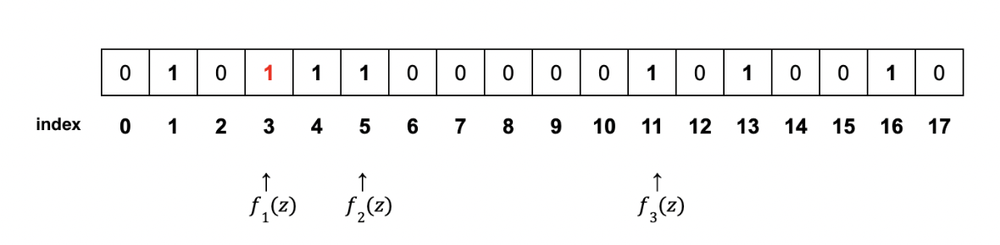

### 탭 루트(Tap root)

탭루트는 슈노르 서명과 함께 세그윗 도입 이후 많은 기대를 모으고 있는 비트코인의 기술적 업그레이드이다.

탭루트의 특징은 프라이버스, 확장성, 보안을 강화하기 위해 비트코인 스크립트 작동 방식에 변화를 주는 것이다.

탭루트(Taproot)는 비트코인의 스크립트를 개선하여 프라이버시를 향상시키고 복잡한 트랜잭션과 관련된 요소를 개선하기 위한 소프트포크이다.  
비트코인의 트랜잭션은 타임락 릴리즈, 다중 서명 조건 등을 포함하여 트랜잭션을 더 복잡하게 만드는 다양한 기능들을 사용할 수 있다.

탭루트가 없었을 때는 누구나 다중 서명을 포함한 모든 비트코인의 트랜잭션 이동 과정을 볼 수 있었다. 이는 모든 사람이 볼 수 있기 때문에 프라이버시에 좋지 않다는 단점이 있다.  
그러나 탭루트 업그레이드를 통하여 트랜잭션에 여러 기능이 포함되더라도 탭루트로 인해 단일한 하나의 트랜잭션처럼 보이게 되며 보내는 주소와 받는 주소만 확인할 수 있게 된다.

#### 장점

- 블록체인상에서 전송 및 저장해야 하는 데이터양의 감소
- 블록당 더 많은 트랜잭션 처리(더 높은 TPS 비율)
- 더 저렴한 트랜잭션 수수료
- 서명을 더 이상 변경할 수 없다.

### 슈노르 서명

탭루트는 슈노르 서명이라하는 또 다른 업그레이드로 인해 탭루트 구현이 가능하게 된다.  
기존의 타원 곡선 디지털 서명 알고리즘은 각 트랜잭션마다 디지털 서명하여 트랜잭션 사이즈가 커질 수 있고, 사이즈가 커지기 때문에 블록에 트랜잭션을 넣을 수 있는 양이 많지 않았다.  
이를 보완하는 슈노르 디지털 서명 체계의 적용은 비트코인 및 다른 블록체인 네트워크 서명의 새로운 시대를 여는 출발점이 될 수 있었다.

슈노르 서명의 주된 특징은 복잡한 비트코인 트랜잭션 내에 다수의 키를 포함할 수 있고, 단일하고 고유한 서명을 생성할 수 있다는 것이다.

### 블룸필터

블룸 필터(Bloom Filter) 특정 원소가 집합에 속하는지 검사하는데 사용할 수 있는 확률형 자료 구조이다.  
확률적 검색 필터로 원하는 패턴이 무엇인지 정확하게 규정할 필요 없이 원하는 패턴을 설명하는 방식이라 할 수 있으며, 즉 통계적 특성을 보였다고 할 수 있다. 또한 많은 양의 데이터를 줄여서 공간 효율적으로 빠르게 검색을 할 수 있다.

블룸필터는 프라이버시를 보호하면서 검색 패턴을 구현하기 위한 효율적인 방법을 제공한다. 또한 블룸필터는 비트코인 언리미티드(Bitcoin Unlimited) 팀이 노드에 알려지지 않은 거래를 식별하는데 도움을 주고 있다.

SPV 노드가 블룸 필터를 사용해 이웃 노드들에게 특정 거래를 제공해 달라고 요청하는데 이때 노드는 검색 중인 주소가 정확히 어떤 주소인지 밝힐 필요는 없다.

#### 블룸 필터 동작 방식

블랙 리스트 기반의 IP주소 검색 및 차단의 예

x, y, z라고 하는 IP를 블랙리스트에 저장하고, 방화벽에서 이러한 블랙 리스트의 IP를 차단하려고 등록한다고 가정한다.

블룸 필터는 N비트 크기의 비트 배열 구조와 , 서로 다른 J가지의 Hash 함수를 사용하여 구현된다. 여기서 해쉬함수는 N가지의 값을 균일하게 출력해야만 한다.

먼저 아래 예시에서는 18(N)개의 비트 배열, 그리고 3(J)개의 해싱 함수를 사용한다.

##### 블랙 리스트에 IP 주소 저장 순서

1. 블랙리스트 로그에 x의 IP를 저장한다.
2. IP x를 가져와 3개의 해싱함수 (f1, f2, f3)로 해싱을 한다.
3. 각 해싱값에 해당되는 해당하는 배열 인덱스 값을 1로 수정한다.

4. IP y로 1~3번 과정을 반복한다.

5. IP z로  1~3번 과정을 반복한다.

##### 블랙 리스트와 IP 주소 비교 순서

1. w라는 IP를 가진 패킷을 받는다.

2. IP w를 위의 방식과 같이 3개의 해싱함수(f1, f2, f3)로 해싱을 한다.
3. 4, 13 인덱스 값은 1이지만 15의 인덱스 값은 0이므로 w라는 IP는 블랙 리스트 IP가 아니다.(만약 4, 13, 15 모두 1이라면 블랙리스트 IP이다 -> False Positive)

#### 블룸 필터 특징

블룸필터는 길이 N의 이진 배열(Binary array)과 1부터 N까지의 출력값을 갖는 J개의 해시함수를 가지고 있다고 했는데 이 N과 J을 조절함으로써 정확도와 프라이버시 보호 수준을 조절할 수 있다.

오탐지율이 존재하기 때문에 결정적(Deterministic) 결과 대신 부정확한 결과를 얻을 수 있다.

False Negative(거짓 - 부정, 존재하지만 부정하는 것)는 존재하지 않는다고 보장할 수 있다.

하지만 False Positive(거짓 - 긍정, 존재하지 않지만 있다고 하는 것)가 존재할 수 있다.

즉 특정 원소가 존재하지 않는다는 부정적인 답변을 받았다면, 이 원소는 확실하게 없다고 할 수 있다.

해시 함수들을 기본적으로 여러 개를 가지는데 임의의 테이블의 크기, 넣어야 하는 자료의 크기, 해시 함수의 수에 따라 오류의 확률이 정해진다.

그래서 요구하는 긍정 오류율이 있다면 넣어야 하는 자료의 크기를 고려해서 테이블의 크기와 해시 함수의 수를 정하는 편이다. 또한 있는지 없는지만을 보는 그 특성 때문에 삽입만 가능하고 제거가 안된다.

위 블랙 리스트 IP를 예로 들면, 리스트에 IP가 추가될 때마다 비트 배열을 초기화하는 것이 아니라 그 위에 덮어쓰는 것이기 때문이다.  따라서 위 블랙 리스트를 예로 들면, 정상 IP를 블랙 리스트로 판단하여 차단할 확률이 존재하는 것이다.

#### 블룸 필터 사용 예

블룸필터는 처리능력 대비 적은 메모리 공간을 필요로 하는 장점 때문에 DB이외에도 많은 곳에서 사용되고 있다.

1. IP 주소 검색 및 차단 필터링
2. 문자열 맞춤법 교정
3. 가상화폐
4. 라우터
5. 크롬 브라우저
6. 빅데이터 환경