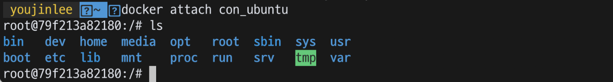

## Docker로 Ubuntu 실행

1. 도커에서 우분투 이미지 다운

   ```shell
   docker search ubuntu
   docker pull ubuntu
   ```

2. 이미지 확인

   ```shell
   docker image ls
   ```

3. con_ubuntu라는 컨테이너를 생성한다.

   ```shell
   docker create -it --name con_ubuntu ubuntu
   ```

4. con_ubuntu 컨테이너를 시작한다.

   ```shell
   docker start con_ubuntu
   ```

5. 실행 중인 컨테이너 목록을 확인한다.

   ```shell
   docker ps
   ```

6. 터미널에 컨테이너를 연결한다.

   ```shell
   docker attach con_ubuntu
   ```

   

7. 컨테이너를 세팅한다.

   ```shell
   apt update -y && apt install -y software-properties-common
   ```

   실행 후 위치와 타임존을 선택해야 한다. 자신의 위치에 맞게 숫자를 입력한다.

   ```shell
   add-apt-repository ppa:ethereum/ethereum
   ```

   ```shell
   apt-get install vim -y
   apt update -y && apt install geth
   apt-get install git -y
   cd ~
   git clone https://github.com/ethereum/go-ethereum
   apt-get install -y build-essential golang
   ```

8. 설치한 geth의 버전 확인

   ```shell
   geth version
   ```

   

## Geth 기초(1) - 계정 생성과 채굴

### 1. 로컬 테스트넷에서 Geth 실행

로컬 테스트넷에서 Geth를 실행하기 위해서는 데이터 디렉터리와 genesis.json 파일이 필요하다.

- 데이터 디렉터리는 송수신한 블록 데이터와 계정 정보를 저장한다.
- genesis.json 은 블록체인의 Genesis 블록의 정보가 저장된 json 형태의 텍스트 파일이다.

1. 데이터 디렉터리와 gensis.json 파일을 만든다.

   ```
   go-ethereum
    - test_data
    	- genesis.json
   ```

2. geth를 실행하여 정상적으로 작동하는지 확인한다.

   ```shell
   geth
   ```

### 2. Geth console을 사용하여 계정 생성

1. 계정 생성

   ```shell
   geth --datadir test_data account new
   ```

   새로운 계정에서 사용할 비밀번호 입력

2. 계정 확인

   ```shell
   geth -datadir test_data account list
   ```

### 3.GenesisBlock 만들기