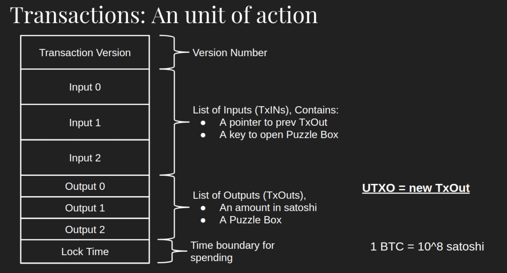
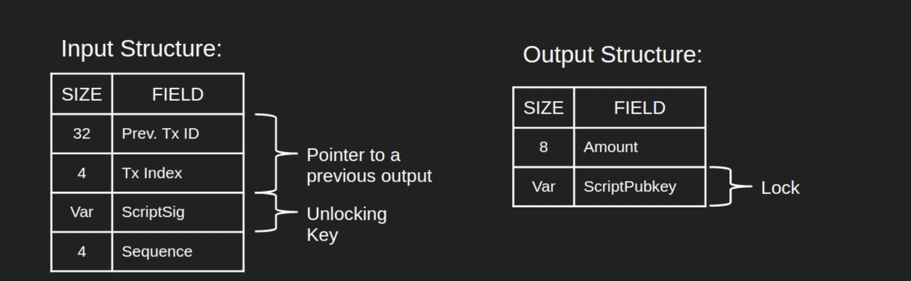
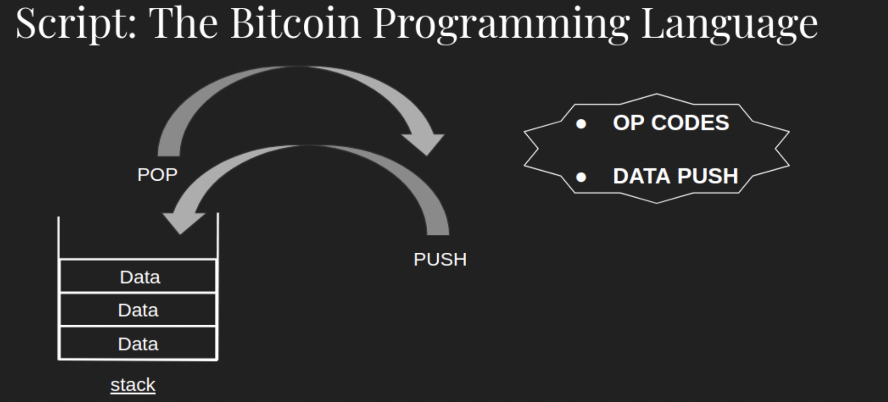
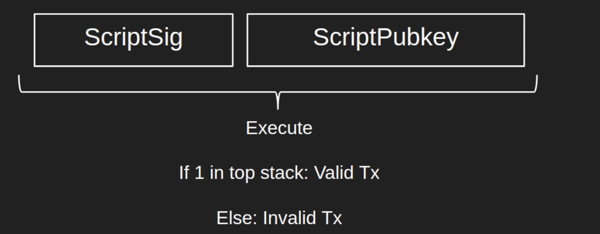
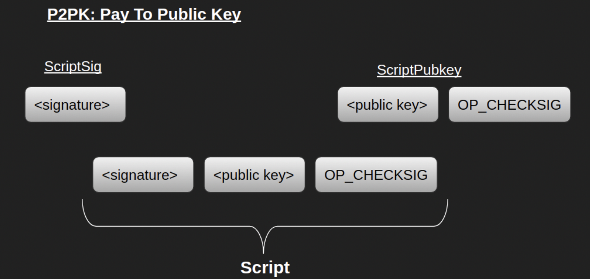
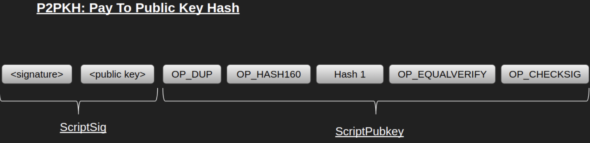
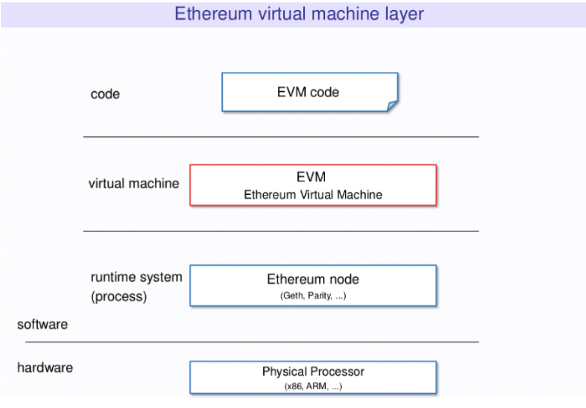
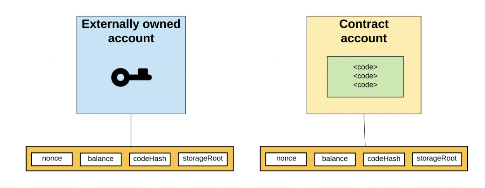
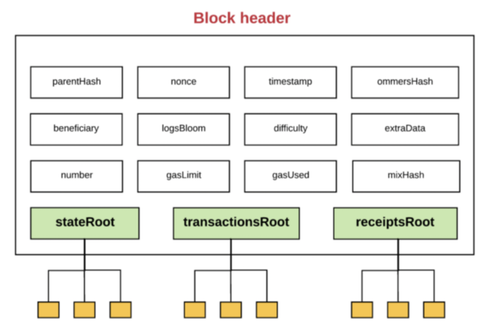
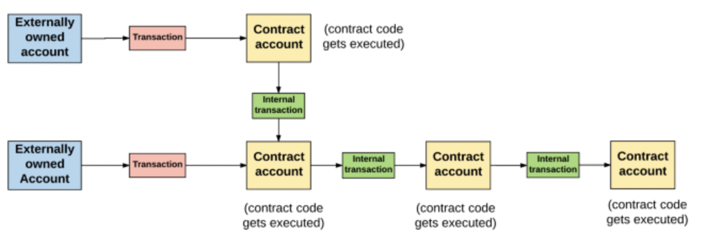

## 스마트 컨트랙트

스마트 컨트랙트는 블록체인 네트워크에 호스팅되고 실행되는 프로그램이다.  
조건을 지정해두고 해당 조건이 충족되면 미리 정해둔 계약을 이행하는 방식으로 코드를 작성한다.

스마트 컨트랙트는 일반적인 중앙 집중식 서버가 아니라 탈중앙화된 블록체인에서 실행하기 때문에, 계약 조건이나 이행 내용을 변조하기 어려우며 계약을 신뢰하기 위한 제삼자가 필요하지 않다.

### 특성과 특징

스마트 컨트랙트는 중개인의 존재 여부와 상과넚이, 조건이 충족된다면 계약이 이행되고, 조건이 충족되지 않는다면 이행되지 않는다는 특징을 가지고 있다. 이러한 스마트 컨트랙트의 특성은 블록체인이 가지고 있는 탈중앙성 특성과 아주 잘 맞는다.

#### 스마트 컨트랙트의 동작 방식

```solidity
if or when(이벤트 x가 실행되면){ //조건
	액션 y를 실행 //계약 이행
}
```

코드가 블록체인 네트워크에 올라가면, 네트워크는 미리 결정된 조건이 충족되고, 검증된 경우 조건에 따른 액션을 실행한다. 이러한 액션은 트랜잭션에 기록되며, 완료된 트랜잭션은 블록체인에 올라간다. 스마트 컨트랙트는 한번 액션이 수행되면 되돌리거나 수정할 수 없다는 것을 의미한다.

따라서 스마트 컨트랙트는 당사자가 스마트 컨트랙트와 상호작용하는 방법을 정의하고, 누가, 언제, 어떤 입력이 어떤 결과를 초래하는지 담고 있다. 결과 값이 담겨있다는 것은 어떤 확률적인 상태(Probabilistic State)가 아니라, 조건에 따른 결과가 미리 결정되어 있다는 것을 의미한다.

코드에 따라 계약이 실행됨을 보장하는 결정론적인 상태(Deterministic State)인 다자간 디지털 계약이 바로 스마트 컨트랙트이다.

### 스마트 컨트랙트 장점

- 보안

  스마트 컨트랙트는 분산형 블록체인 인프라 위에서 실행되기 때문에, 한번 스마트 컨트랙트 코드가 블록체인 네트워크에 올라가면 모든 노드가 스마트 컨트랙트 내용과 이행 결과를 가지게 된다. 따라서 계약에 대한 중앙화된 공격 지점이 없고, 누군가에게 뇌물을 주고 계약 내용이나 결과를 변조할 위험이 없다.

- 신뢰성

  스마트 컨트랙트 로직이 조건에 부합해 계약이 이행되면 블록체인 네트워크에 있는 노드들에 의해 여러번 수행되고 검증되기 때문에, 위변조가 매우 어렵고 정확도가 높다.

- 공평함

  계약 조건을 공유하고 강제하기 위해 분산화된 블록체인 네트워크를 사용하기 때문에, 수수료를 가져가는 등 영리적 목적의 중개자가 필요하지 않다.

- 효율성

  계약 이행을 자동화하기 때문에 계약 당사자들은 수동으로 데이터를 입력하거나, 상대방의 계약 의미 이행 여부 검증하거나, 중개자가 계약을 집행하는지 확인할 필요가 없다.

### 한계점

1. 컨트랙트 배포 이후엔 작동 수정이 불가하다.

   내용을 수정할 수 없다는 것은 장점이 될 수 있고, 반대로 한계점이 될 수 있다. 만약, 배포한 컨트랙트에 보안 측면에서 허점이 발견될 경우 해킹에 취약하다.

2. 블록체인 외의 정보를 스스로 취득하지 못한다.

   블록체인 내부에 있는 정보 외의 정보는 스스로 취득할 수 없기에, 외부 데이터의 조건 충족을 확인할 때 문제가 발생한다. 이러면 제 3자에 의해 직접 데이터를 입력해야 한다. 외부 데이터를 가지고 온다고 하더라도, 전달 과정에서 오류가 나거나 악성 코드를 의도해서 입력하는 경우에도 문제가 발생할 수 있다.

## 비트코인에서의 스마트 컨트랙트

### UTXO 동작 원리

비트코인은 특정 지갑에 저장되는 것이 아닌 UTXO에 저장되며, 이 UTXO를 통해 코인의 존재 여부를 확인할 수 있다.

#### 트랜잭션 구조



하나의 트랜잭션은 위와 같은 모양이며 다양한 데이터 구조들로 구성되어 있다.

- 트랜잭션 버전(Transaction Version)

  트랜잭션은 버전 별로 그 구조와 규칙이 조금씩 다르기 때문에 노드는 트랜잭션을 읽을때 버전 번호를 확인하고 트랜잭션을 어떻게 읽어야 하는지 파악할 수 있다.

- 잠금 시간(Lock Time)

  마지막 데이터는 잠금시간으로 트랜잭션을 블록체인에 바로 포함할 수 있는지, 아니면 지정된 시간이 지나면 포함할 수 있는지를 지정한다.

- 입력(Inputs)과 출력(Outputs)

  트랜잭션의 출력은 지폐를 사용하는 것과 같다. 5만원을 사용하면 2만원을 제한 3만원을 돌려받는다. UTXO도 동일하다.

  트랜잭션의 출력은 일종의 5만원권과 같다. 출력은 잠금(Lock)과 값(Value)으로 구성되어 있다. 출력은 기본적으로 잠겨있으며, 입력에는 잠금을 해제할 수 있는 키(Key)가 들어있다. 값은 출력 내에 잠겨있는 사토시(비트코인의 단위)의 양을 의미한다.

  트랜잭션 입력은 우리가 지불할 치킨값 2만원과 비슷하다. 포인터(Pointer)와 해제키(Unlocking key)가 들어있다. 포인터는 이전 트랜잭션 출력을 가리키며 키는 포인터로 가리키고 있는 이전 출력을 해제하는 데 사용된다. 그리고 남은 3만원은 돈을 지불한 사람에게 돌려주어야 하므로 새로운 출력을 만든다.

  출력에는 자산이 잠겨있고, 입력으로 출력을 해제하여 출력에 있는 값을 꺼내 새로운 출력에 자산을 담는다.

  트랜잭션에는 다른 곳에 잠겨있는 출력을 해제하는 입력과, 입력의 결과로 생긴 새로운 출력이 담기게 된다. 따라서 트랜잭션은 이전 출력을 해제하고, 새로운 출력을 만드는 추상적인 액션이라고 볼 수 있다. 이렇게 입력에 의해 생성된 후 다른 입력에 의해 해제되지 않은 트랜잭션 출력은 **UTXO**라고 한다.

### 비트코인 스크립트

비트코인에서는 **스크립트(Script)**라는 스크립터 언어를 사용해 스마트 컨트랙트를 구현한다. 일반적으로 비트코인에서 사용하는 스크립트는 비트코인 스크립트라고 부른다. 비트코인 스크립트는 일반적인 프로그래밍 언어와는 다르게 어떤 공식적인 문법이나 구문이 있는 것은 아니며 간단한 연산 목록으로 구성되어 있다. 스크립트에서 사용하는 연산들은 Opcode에 해당하며, 이 연산들은 C++로 작성되어 있다.

#### 입력값과 출력값



입력 구조

- Prev.Tx Id, TxIndex : 해제하고자 하는 이전의 출력을 가리키는 포인터
- ScriptSig : 이전의 출력을 해제하는 키

출력 구조

- ScriptPubkey : 잠금. ScriptPubkey의 소유자만이 ScriptSig를 만들수 있다.
- Amount : 잠김 비트코인의 양

노드는 피어로부터 트랜잭션을 받으면 먼저 해당 트랜잭션 안에 들어있는 입력과 출력 목록에서 각 입력과 출력에 해당하는 ScriptSig와 ScriptPubkeys를 추출한다.그리고 기존 블록들을 찾아보며 입력과 연결된 이전 출력을 찾고, 각 입력과 출력에 들어있는 ScriptSig와 ScriptPubkey를 연결한다.

ScriptSig와 ScriptPubkey는 각각 연속적인 정보를 담고 있다. 노드가 ScriptSig와 ScriptPubkey를 연결하고, 그 연결한 전체 시퀀스를 파싱하면 온전한 스크립트 코드가 나타나게 된다. 노드는 이 코드를 단계별로 실행한다.

#### 스크립트 동작 원리

스크립트는 역폴란드 표기법(Reverse Polish Notation)으로 작성된 스택 기반 튜링 불완전 언어이다.



스크립트는 빈 스택에서 시작하며, 이 스택에서 데이터가 들어오거나(Push) 나가게 된다(Pop).

스크립트 프로그램은 두 종류의 객체를 가지고 있다.

- Opcode: 덧셈, 뺄셈, 곱셈과 같은 연산 작업을 나타낸다.
- 데이터: OP-CODE가 아닌 모든 데이터는 원시 데이터로 해석되며, 스택에 들어가게 된다.

스크립트는 이 Opcode와 Data를 일렬로 늘어놓은 것이다. 여기서 포인터는 일렬로 늘어진 Opcode와 데이터를 순서대로 하나씩 가리킨다. 만약 포인터가 데이터를 가리키면 데이터를 스택에 넣고, Opcode를 가리키면 스택에서 데이터를 꺼내온다.

스크립트 실행이 성공적이면 스택의 가장 상단에 요소는 1이된다. 만약 1이 아닌 다른값이면 스크립트 실행을 실패한 것으로 간주한다.

노드가 네트워크로부터 새로운 트랜잭션을 받으면, ScriptSig와 ScriptPubkey 필드를 추출하여 연결하여 최종적으로 ScriptSig, ScriptPubkey 형태의 스크립트를 얻게 된다. 노드는 이 스크립트와 빈 스택 하나를 사용해 스크립트를 실행하고 실행이 완료되면 최상위 스택 요소가 1인지 확인한다. 1이면 트랜잭션이 유효하다 간주하고 노드는 트랜잭션을 주변 노드들에게 전파한다. 반대이면 주변 노드들에게 트랜잭션을 보내지 않고 네트워크에 트랜잭션이 공유되지 않게 된다.

트랜잭션은 네트워크에 있는 모든 노드가 받을 수 있기 때문에, 네트워크의 모든 노드는 전체 네트워크의 상태를 지키는 문지기 같은 역할을 하게 된다.



### 자주 쓰이는 비트코인 스크립트

#### Pay To PubKey(P2PK)



ScriptPubkey는 잠금을 정의하는 데이터 구조이며, ScriptSig는 해제 키를 정의하는 데이터 구조이다. ScriptSig는 트랜잭션 입력(Input) 내부에 존재하며 ScriptPubkey는 이 트랜잭션 입력이 잠금을 해제하려는 이전 트랜잭션의 출력(Output)에서 추출된다.

"잠금을 해제한다"는 것은 ScriptSig와 ScriptPubkey를 연결하여 스크립트 코드로 만들어 실행하고, 실행 후 스택 최상단에 값이 1인 요소를 남기는 프로세스이다.

#### PayToPubKeyHash(P2PKH)



P2PK와는 다르게, 서명과 공개키가 ScriptSig에 들어있다. ScriptPubkey는 P2PK에서와 다르게 여러개의 Opcode를 가지고 있으며, 수신자의 공개키를 해싱한 값인 Hash 1 객체가 들어있다. 비트코인을 보내는 동안 송신자는 공개키의 해시값을 보내기 때문에 스크립트 이름의 PayToPubkeyHash인 것이다.

**비트코인 스크립트가 스마트 컨트랙트인 이유**

UTXO는 일종의 "계약"으로 정의될 수 있으며, 이 계약은 유효한 해제 조건을 주면 잠긴 비트코인을 이동시킨다. 오직 유효한 해제 조건을 줘야만 코인을 송금할 수 있는 계약인 것이다. 이 계약의 실행은 비트코인 네트워크가 보장하기 때문에 계약 이행을 강제하기 위한 중개자가 필요하지 않다.

### 비트코인 스마트 컨트랙트의 한계

비트코인은 최초의 블록체인 알고리즘이지만 확장성이나 성능 등의 한계가 존재했다. 오늘날에는 비트코인의 단점을 극복하기 위한 다양한 플랫폼과 프로젝트가 존재한다.

**라이트닝 네트워크(Lightning Network)**

비트코인의 거래량이 늘어날수록 처리해야 할 트랜잭션이 많아진다. 그런데 비트코인의 TPS는 트랜잭션 양과 관계없이 고정되어 있기 때문에 저장해야할 트랜잭션이 많아질수록 트랜잭션이 처리되는 속도가 느려지게 된다.

라이트닝 네트워크에서는 트랜잭션 내용은 블록체인 외부에 저장하고, 트랜잭션의 최종 결과만 블록체인에 올린다. 트랜잭션이 블록체인 바깥에서 이루어지기 때문에 트랜잭션이 처리되기까지 대기시간이 필요하지 않아 즉시 처리된다.

이러한 기능을 구현하기 위한 핵심 기술은 다중 서명(Multi Signature, Multi-Sig)과 시간 잠금 계약(Hashed Timelock Contract)이다.  
다중 서명을 통해 블록체인 외부에서 트랜잭션을 실행할 때는 계약 당사자들끼리 합의를 진행하고, 트랜잭션 결과를 체인에 기록할 때 계약 당사자들의 개인 키로 공동 계좌를 만들어 비밀 키를 생성한다. 또한 시간 잠금 계약은 일정 시간이 지나 트랜잭션이 확정되었을 때까지 트랜잭션을 변경할 수 없게 하여 계약 당사자가 트랜잭션을 임의로 수정하지 못하도록 한다.

**루트스탁(Rootstock, RSK)**

루트스탁은 비트코인에 스마트 컨트랙트 기능을 탑재하는 사이드체인 프로젝트이다. 비트코인에서도 스마트 컨트랙트 구현이 가능하지만, 기본적으로 연산에 대한 수수료가 비싸기 때문에 실질적으로는 사용이 어려웠다. 또한 비트코인 스크립트는 튜링 불완전하기 때문에 사용성 측면에서 제약이 컸다.

루트스탁은 2-Way peg를 이용해 비트코인에 튜링 완전한 스마트 컨트랙트를 지원하는 블록체인을 쌍방향으로 연결하며, 병합 채굴(Merge-Mining)을 통해 비트코인 채굴 노드가 사이드체인 블록까지 채굴할 수 있도록 연결한다. 이를 통해 비트코인 네트워크에서도 튜링 완전한 스마트 컨트랙트를 실행할 수 있게 되었다.

**탭루트(TapRoot)**

탭루트는 2021년 11월에 이루어진 비트코인 업그레이드를 의미한다. 탭루트에는 슈노르 서명과 MAST 등 중요한 사항들이 포함되어 있다.

슈노르 서명은 기존 다중 서명처럼 여러 개의 서명을 받는 것이 아니라, 여러개의 서명을 기반으로 한 하나의 공동 서명을 만들기 때문에 트랜잭션의 크기가 커지지 않는다.

MAST(Merkelized Abstract Syntax Tree, 머클 추상화 구문트리)는 비트코인 스크립트에서 해시값을 추출하는 자료구조로, 스크립트의 조건 중 필요한 부분만 먼저 검증할 수 있도록 하였다. 또한 MAST를 슈노르 서명과 결합하는 경우, 서명을 단 한번만 해도 트랜잭션이 이루어질 수 있기 때문에 속도가 개선되고, 효율성이 증대되는 효과가 있다.

## 이더리움에서의 스마트 컨트랙트

이더리움은 개발자들이 dApp을 만들 수 있도록 튜링 완전한 언어인 솔리디티(Solidity)를 제공하였으며, 이더리움 네트워크에 올라간 솔리디티 코드는 EVM을 통해 실행된다.

### EVM



EVM은 우리가 짠 코드와 이더리움 블록체인 사이에 있는 가상 머신으로, 블록체인에서 코드가 실행될 수 있도록 한다.

이더리움 스마트 컨트랙트에 기반한 dApp은 솔리디티라는 언어로 작성된다.  
우리는 솔리디티로 작성된 dApp을 이더리움 네트워크에 올려야 한다.

그런데 솔리디티 언어는 고급 언어이기 때문에 EVM이 바로 해석하기 어렵다.  
말 그대로 EVM은 가상 머신, 기계이기 때문에 언어를 바이트코드(bytecode)로 변환해주어야 한다.

이후 바이트 코드를 EVM이 해석할 수 있는 OP 코드로 변환하고, 그 이후 실행할 수 있다.

먼저 우리가 작성한 솔리디티 코드를 solc를 이용해 컴파일하여 EVM이 읽을 수 있는 바이트코드 형태로 만든다. 그리고 이 바이트코드를 Geth를 이용해 이더리움 네트워크에 올린다.

즉, **솔리디티 코드 -> 바이트 코드 -> Opcode** 흐름이다.

블록체인에 저장된 바이트코드 형태의 dApp은 EVM에서 실행하게 되며, EVM에서는 바이트코드를 Opcode로 변환하여 실행한다. 솔리디티로 작성된 스마트 컨트랙트는 EVM에서 동작하기 때문에 특정 운영체제나 하드웨어 종속되지 않는다.

### 솔리디티(Solidity)

솔리디티는 스마트 컨트랙트를 실행하는 객체 지향(Object-Oriented), 정적 타입(Static Typed), 고급(High-Level) 스크립트 언어로, EVM에서 실행된다.  
솔리디티는 컨트랙트 기반의 고급 프로그래밍 언어이다. C++과 파이썬, 자바스크립트를 기반으로 만들어졌으며, 이더리움 네트워크에서 스마트 컨트랙트를 생성할 수 있도록 설계되었다.  
솔리디티는 정적 타입 스크립트 언어이기에, 런타임 언어와는 달리, 컴파일 시 제약 조건을 확인하고 적용한다.

**솔리디티는 튜링 완전 언어이다.**

비트코인 스크립트와 비교해서 솔리디티의 가장 큰 특징은 튜링 완전/불완전이다.

비트코인 스마트 컨트랙트에서는 무한 반복 공격과 같은 보안상의 이슈를 고려해 의도적으로 반복문 Opcode를 제외했다. 따라서 비트코인 스크립트를 두고 튜링 불완전하다고 말한다.

이더리움의 핵심은 이러한 비트코인의 튜링 불완전성이라는 한계를 넘어, 개발자가 원하는 스마트 컨트랙트를 유연하게 구현할 수 있도록 튜링 완전을 제공하는 것이다. EVM은 반복문 Opcode들을 지원하는 대표적인 튜링 완전 머신이며, 솔리디티는 튜링 완전 머신을 동작하게 하는 튜링 완전 언어이다.

#### 솔리디티 개발 도구

dApp의 백엔드 개발도구들은 대표적으로 다음과 같은 것들이 있다.

- Remix IDE

  솔리디티를 사용한 dApp 개발을 도와주는 통합 개발 환경이다. Remix IDE는 자바스크립트로 만들어졌기 때문에 브라우저에서 사용가능하며, 로컬이나 데스크톱 버전을 사용할 수도 있다.

- solc

  솔리디티는 고급 언어이기 때문에 가상 머신인 EVM은 솔리디티를 읽을 수 없다. 따라서 솔리디티를 바이트코드로 컴파일해야 하는데 이때 사용하는 컴파일러이다.

- Ganache

  개발 단계에서 시뮬레이션 테스트 환경을 구성해주는 도구이다. 실제 이더리움 메인넷에서 테스트를 하기 위해서는 이더를 내야 하지만, Ganache를 사용하면 채굴없이 가상 이더리움 환경에서 트랜잭션 제한 없이 테스트를 할 수 있다.

- TestNet

  이더리움에서 제공하는 퍼블릭 테스트 네트워크이다. 테스트 네트워크는 실제 이더리움과 비슷하지만, 실제 트랜잭션이 이루어지지 않는다. 이더리움에는 현재 Ropsten, Kovan, Rinkeby 세개의 퍼블릭 테스트넷이 제공되고 있다.

- 프레임워크 : Truffle, Embark, Dapple

  솔리디티 코드를 이더리움 네트워크에 올리기 위한 여러 복잡한 과정을 해결해주는 다양한 프레임워크들이 있다. 이 프레임워크들은 솔리디티 코드에 대해 테스트, 디버깅, 컴파일, 배포를 제공한다.

### EVM의 내부 동작 구조

**이더리움은 상태 머신**

이더리움은 거래에 기반을 둔 상태머신이다. 상태 머신이란 일련의 입력을 읽고, 그 입력을 기반으로 새로운 상태로 전환하는 것을 의미한다.

이더리움이라는 상태 머신은 Genesis State에서 시작한다. 그리고 트랜잭션이 실행되면 다음 상태로 전환하게 된다. 더 이상 트랜잭션이 들어오지 않은 마지막 상태가 바로 이더리움의 현재 상태이다.

이더리움의 상태에는 수천개의 트랜잭션이 있다. 이 트랜잭션은 블록이라는 그룹에 묶여 있으며, 블록은 직전에 만들어진 블록과 이어져 있다.

#### EOA와 CA

이더리움에는 EOA(External Owned Account)와 CA(Contract Account)라는 두 종류의 계정이 있다. 모든 계정은 주소로 식별되며, 동일한 주소 공간을 가진다. EVMdms dl 160bit 길이의 주소들을 처리한다.

EOA와 CA 모두 잔액(Balance), 논스(Nonce), 스토리지(Storage), 컨트랙트 코드(Contract Code)로 구성되어 있다.

- Balance : 계정의 현재 이더 잔고

- Nonce : EOA의 경우, 해당 EOA로부터 보내진 트랜잭션의 숫자, CA의 경우, 해당 CA로부터 생성된 컨트랙트의 숫자를 의미한다.
- StorageRoot : 머클 패트리샤 트리의 루트 노드를 해싱한 값이다.
- Contract Code : EVM이 실행할 코드의 해싱된 값. EOA에는 코드를 저장할 수 없기 때문에 비어있다.

EOA의 주소는 상응하는 비밀 키를 가지고 있지만, CA는 비밀 키가 없다.



또한 CA는 스스로 새로운 트랜잭션을 만들 수 없으며, CA는 EOA나 다른 CA에게서 방은 트랜잭션에 대한 응답에 대해서만 트랜잭션을 만들 수 있다.

따라서, 이더리움 블록체인에서 일어나는 모든 액션은 항상 EOA에서 만든 트랜잭션에서부터 시작한다.

#### 전역 상태

이더리움의 전역 상태는 계정 주소와 계정 상태를 매핑한 것으로 구성되어 있다. 이 매핑은 머클 패트리샤 트리형태로 저장되어 있다.

트리 맨 아래에 있는 데이터는 저장하려는 데이터를 청크(Chunk)로 분할한 다음, 각 청크를 두 개씩 모아 해시를 취하여 부모 노드를 만든다. 그렇게 하나의 루트 노드가 만들어질 때까지 동일한 과정을 반복한다.

이더리움의 블록 헤더에는 세 개의 머클 트리 구조의 루트 노드의 해시값이 저장되어 있다.

1. 상태 트리(State Tree) : 트랜잭션과 연관된 계정의 상태 정보 저장
2. 트랜잭션 트리(Transaction Tree) : 현재 블록의 트랜잭션 정보 저장
3. 영수증 트리(Receipt Tree) : 현재 블록의 거래 영수증 정보 저장



머클 패트리샤 트리에서 변조가 시도되면 그 즉시 발견된다. 따라서 루트 노드는 데이터에 대한 보안 ID처럼 사용될 수 있다. 또한 블록 헤더는 상태, 트랜잭션, 영수증 트리의 루트 노드 값을 가지고 있기 때문에, 네트워크의 노드들은 모든 상태를 저장하고 있지 않더라도 이더리움의 상태 일부분을 검증할 수 있다.

#### 트랜잭션과 메시지

기본적으로 트랜잭션은 EOA에서 생성되고, 일련의 과정을 거쳐 블록체인에 올라간 **암호화 서명된 명령어의 집합**이다.

그 외의 트랜잭션은 **메시지 호출(Message Call)**과 **컨트랙트 생성(Contract Creations)** 두 종류로 나뉜다.

이더리움의 모든 트랜잭션은 항상 EOA에서 만들어지고 블록체인에 올라간다. 즉, 트랜잭션은 외부 세계를 이더리움 내부의 상태로 연결해주는 다리와 같다. 그리고 연결의 창구가 바로 CA이다.

이더리움 전역 상태에 있는 CA는 메시지(Message)나 내부 트랜잭션(Internal Transaction)을 통해 다른 CA와 상호작용 할 수 있다. 메시지와 내부 트랜잭션은 일반적인 트랜잭션과 비슷하지만 EOA에서 생성되지 않으며, 오로지 CA에서만 생성된다. 또한 일반적인 트랜잭션과는 다르게 미시지와 내부 트랜잭션은 EVM에만 존재하는 가상 객체이다.

한 CA가 다른 CA에 내부 트랜잭션을 보내면 수신하는 CA에 있는 관련 코드가 실행된다.

