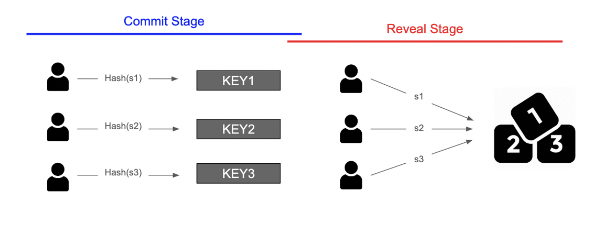
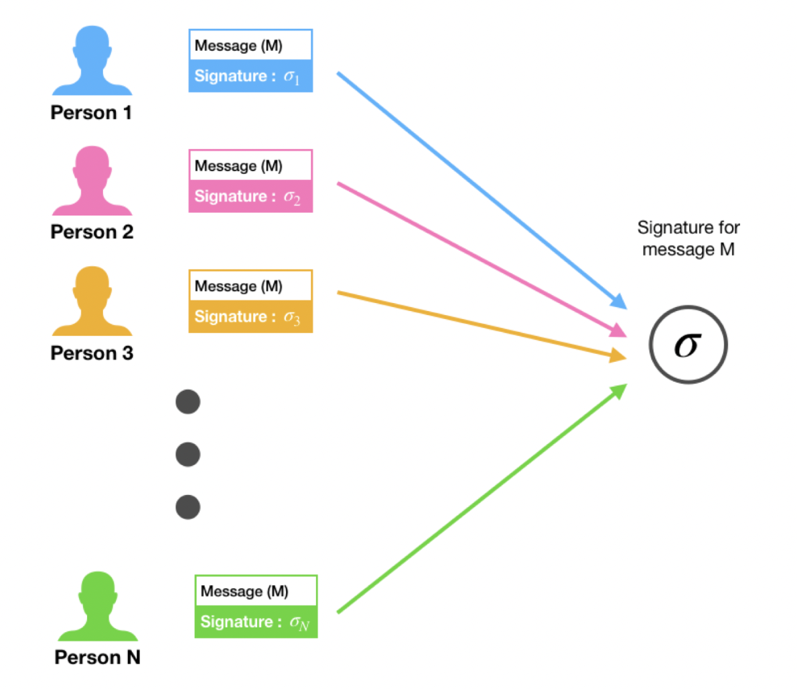

## 오라클

오라클은 Web API나 마켓 데이터 피드와 같은 방식을 통해 블록체인과 스마트 컨트랙트용 외부 데이터를 검색하고 검증하는 것을 의미한다. 스마트 컨트랙트에서 요구하는 데이터 종류에는 가격 정보, 날씨 정보, 또는 게임을 위한 난수 생성 등이 있다.

오라클은 특정 정보에 대해 데이터 자원을 쿼리하고, 블록체인과 외부 데이터 간의 인터페이스를 제공하는 것으로 구성된다. 그 결과 스마트 컨트랙트는 외부 데이터로부터 오는 특정 정보에 의해 실행될 수 있다. 오라클은 외부에서 오는 비결정적인 정보를 블록체인이 이해하고 특정 조건에서 실행할 수 있도록 하는 형식으로 만들어주는 가교 역할을 한다.

### 오라클 문제

오라클 문제는 서드 파티 오라클과 스마트 컨트랙트의 무신뢰성 실행 간 보안, 인증, 신뢰 충돌 문제에 관한 것이다. 스마트 컨트랙트는 주어진 데이터에 따라 계약 이행 여부를 결정할 뿐이지, 데이터에 대한 자체적인 판단 능력은 갖추고 있지 않다. 즉 스마트 컨트랙트로 들어오는 데이터에 대한 출처나 신뢰도가 불명확할 수 있다는 것이다. 출처가 분명하더라도 외부 데이터를 가져오는 과정에서 해커에 의해 위변조가 일어날 수도 있다.

#### 컴퓨터에서의 난수 생성

컴퓨터 과학에서 난수는 유사 난수와 진짜 난수로 나뉜다.

유사 난수는 컴퓨터에 있는 데이터와 알고리즘을 통해 얻게 되는 난수이다. 이 난수는 컴퓨터 내부에 있는 알고리즘과 데이터를 가지고 생성되었기 때문에 특정한 패턴을 가지게 되고 이에 따라 예측할 수 있다. 진짜 난수는 외부로부터 불확실성을 가져와 생성한 난수값이다. 컴퓨터 외부에서 값을 가져왔기 때문에 조작할 수 없으며, 따라서 예측할 수도 없다.

#### 블록체인에서의 난수 생성 문제

블록체인에서 난수를 생성하는 방식에는 다음과 같은 방식이 있다.

1. 물리 현상을 가져오기
2. 여러 사용자가 가져온 값을 사용하기
3. 블록체인 내부의 값 사용하기

블록체인에서는 모든 노드가 트랜잭션을 검증함으로써 데이터의 무결성을 보장하기 때문에, 블록체인에서 일어나는 모든 동작은 결정적인 방식으로 일어난다. 예를 들어, 이더리움 스마트 컨트랙트에는 랜덤 함수가 구현되어 있지 않다. 노드들이 블록을 검증하기 위해서는 블록에 있는 트랜잭션을 실행한 결과 상태 값과 자신이 가지고 있는 상태 값을 비교해야한다. 그런데 트랜잭션에서 무작위 값이 나오면 트랜잭션을 실행한 결과 상태 값이 매번 변할 것이기 때문에 데이터의 무결성을 증명하기가 매우 어려워진다.

그러나 우리가 원하는 난수 생성은 결정적이면 안된다. 매번 예측할 수 없는 값이 나와야 예측하거나 조작할 수 없기 때문이다. 그러나 블록체인에서는 진짜 난수를 만들 수 없기 때문에 난수 생성과정에서 나온 값이 진짜 무작위값이라는 것을 보장할 수 없다.

위의 방식에서도 악의적인 사용자가 난수 생성을 조작할 수 있기 때문이다..

따라서 블록체인에서 조작하거나 예측할 수 없는 진짜 난수를 만들 때는 이 난수값이 정말로 조작되지 않았는지 증명할 수 있어야 한다.

#### 블록체인에서 난수 생성하기

1. Commit Reveal Scheme

   기존의 여러 사용자가 가져온 값을 사용하는 경우를 개선한 방식이다. 기존에는 서로가 서로의 값을 알 수 있었지만, 스마트 컨트랙트를 사용하면 서로의 값을 모른 채로 값을 제출할 수 있다.

   먼저 Commit Stage에서는 자신이 자신이 보내려는 값을 암호화하고 일정금액의 토큰과 함께 스마트 컨트랙트에 보낸다. 토큰은 예치금의 역할을 한다.

   

   그리고 일정 기간이 지나면 자신이 제출하려고 했던 원래 값을 스마트 컨트랙트에 보낸다. 스마트 컨트랙트는 사용자가 보낸 원래 값을 암호화하여, 이전에 보낸 암호화된 값과 비교한다. 만약 다른 값을 보냈다면 이 유효성 검사를 통과하지 못한다.  
   사용자가 올바른 값을 보냈다면 토큰을 돌려주고 스마트 컨트랙트는 주어진 값들을 사용해 난수를 생성한다.

   Commit Reveal Scheme을 사용하면 서로가 어떤 값을 보내는지 모르기 때문에 난수 값을 예상하거나 난수 생성을 조작할 수 없을 뿐더러, 유효성 검사 과정을 통해 난수값을 조작할 수 없다는 것을 증명할 수 있다.

2. BLS Scheme

   

   BLS Scheme은 임계값 서명의 한 종류이다. BLS Scheme에서는 N명의 사용자가 개인키 S를 쪼개어 가지고 있다가, 난수를 생성해야할 때 참여자들이 각자 자신이 가지고 있는 개인키 조각을 제출한다. 이때 개인키를 k명 이상이 제출하면 k개의 개인키 조각을 가지고 난수를 생성한다.

   Commit Reveal Scheme은 한두명이 정직하지 않더라도 난수 생성이 불가능해질 수 있지만, BLS Scheme은 k명의 사람이 정직하면 난수를 생성할 수 있다는 장점이 있다.

   