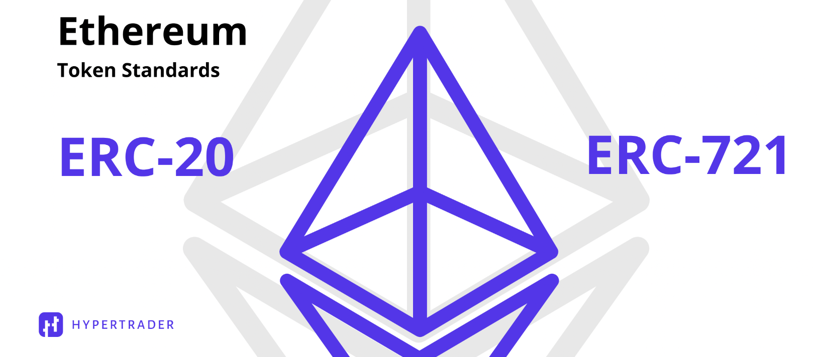

### ERC-721

EIP-721에서는 '각각 구분할 수 있는 토큰'에 대한 토론이 이루어졌으며 이더리움 커뮤니티의 많은 동의를 얻어 ERC-721로 정의되었다.

EIP-721 : 대체 불가능한 토큰을 위한 표준 인터페이스

**NFT** : 대체 불가능한 토큰(non - fungible tokens)

NFT는 디지털 혹은 물리적 자산에 대한 소유권을 나타낼 수 있다. 우리는 다양한 자산의 종류를 고려하였으며, 우리가 모르는 더 다양한 자산이 있을 수 있다.

- 물리적 자산 - 주택, 고유한 예술 작품
- 가상 공간의 수집 자산 - 고유한 아기고양이 사진, 수집할 수 있는 카드
- "부정" 자산 - 대출, 의무, 책임

NFT는 구별될 수 있으며, 각 NFT의 소유권은 각각 별도로 추적해야 한다.

즉, "ERC-721 인터페이스에 따라 구현된 토큰"인 NFT는 각각의 토큰 하나하나가 **고유하고 식별할 수 있다.**

#### 디지털 자산의 소유권

새로운 NFT를 블록체인상에 올리는 것을 mint(민팅)라고 한다.

원본에 대한 소유권을 토큰화하여 이더리움 블록체인상에 민팅한 후 낙찰되게 되면, NFT는 낙찰되는 즉시 해당 낙찰자의 계정 주소로 소유권이 이전된다.

이 낙찰자는 이제 자신의 계정에 있는 NFT를 통해 원본의 소유자임을 증명할 수 있게 된다.

#### ERC-20과 ERC-721의 차이점

EIP-721은 ERC-20 토큰 표준에서 영감을 얻었으며, EIP-20이 만들어진 이후 2년간의 경험을 토대로 만들어졌다. EIP-20은 NFT를 추적하기에 충분하지 않은데, 각각의 자산은 동일한 토큰의 양을 가지되, 고유하게 구별되어야 하기 때문이다.

ERC-20 은 NFT와 비교했을때 **Fungible**, 다시 말해 '대체 가능한' 토큰이라는 의미이다.

화폐처럼 ERC-20 토큰 표준으로 발행되는 토큰은 완전히 같은 가치를 가지며, 하나의 토큰이 다른 토큰을 대체할 수 있다.

반면, ERC-721 표준으로 발행된 토큰인 NFT는 말 그대로 non-fungible(대체 불가능) 하다.

민팅된 두 개의 서로 다른 토큰을 보면 발행한 컨트랙트도 동일하고, 표준도 동일하지만, 이 두 토큰은 각자 고유한 성질을 가지고 있다.

이 고유한 특성 때문에 각 NFT는 동일한 표준과 컨트랙트에서 민팅되었지만, 서로 다른 가격을 가지게 된다.  
그리고 구매를 원하는 사람이 많을수록 더 높은 가격을 가지게 된다. 

**즉, NFT가 가지는 성질은 고유하며, 서로 다른 두 NFT가 갖는 가치가 다른 것이다.**