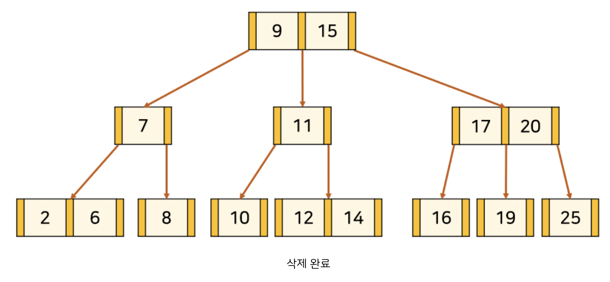

## B-tree

### 개념

B-트리는 데이터를 효율적으로 저장하고 탐색하기 위한 자료 구조입니다. 데이터를 순서대로 저장하고 빠르게 검색하는데 사용됩니다.

이진트리와는 다르게 계속해서 balance를 유지하려고 하는 것이 특징으로 이진트리는 최악의 경우 한쪽으로 쏠리는 현상이 나타나서 N의 시간복잡도가 생길 수 있지만 b-Tree는 평균 logN의 시간 복잡도를 가지게 됩니다.

또한 대용량 데이터는 메모리가 아닌 주로 외장하드에 저장되며 디스크는 고정 크기 블록으로 배열된다.

그래서 탐색을 할때 노드가 저장된 블록이 메모리로 로드되는 형태이다. 그래서 블록안에 데이터의 양이 어떻든 고정된 크기를 가져오게 되어있으므로 이진트리형태가 아닌 여러 데이터를 담을 수 있는 트리형태로 발전시켜 효율적으로 저장하고 탐색할 수 있게 만든 트리 형태의 자료 구조입니다.

대량의 데이터를 처리해야 할 때, 검색 구조의 경우 하나의 노드에 많은 데이터를 가질 수 있다는 점은 상당히 큰 장점이다.

대량의 데이터는 메모리보다 블럭 단위로 입출력하는 하드디스크 or SSD에 저장해야하기 때문이다.

 한 블럭이 1024 바이트면, 2바이트를 읽으나 1024바이트를 읽으나 똑같은 입출력 비용 발생. 따라서 하나의 노드를 모두 1024바이트로 꽉 채워서 조절할 수 있으면 입출력에 있어서 효율적인 구성을 갖출 수 있다.

### B-tree 시간복잡도 logN의 증명

16 8 4 2 1 => k번째에 1이 된다 생각하면

2^k = N

K = logN 이 된다.

자식노드의 개수로 쪼개지기 때문에 이를 활용하여 log3 N 될수 도 있다.

평균적으로 logN의 시간 복잡도를 갖게 만들어준다.

### 특징

- 모든 리프노드가 같은 레벨

- 여러 개의 자식을 가질수 있다. N(데이터 개수)+1개 만큼의 자식노드를 가진다.

- 루트와 잎들을 제외한 모든 노드는 적어도 *m*/2 개의 자식들을 가진다.

- 모든 노드가 가질 수 있는 키-링크 쌍 k의 수는 *M/*2≤*k*≤*M*−1 개이다.

- 블록 단위 접근

- - btree는 데이터를 블록단위로 저장하고 접근하며 블록은 보통 디스크 또는 메모리의 고정된 크기를 가진다. 그래서 한번에 하나의 블록을 읽거나 쓸 수 있고 이를 통해 입출력 비용을 최소화하고 효율적인 데이터 접근이 가능하게 한다.

- 삽입, 삭제 시 b-tree 구조를 맞추기 위해 동적으로 트리 구조를 조정할 수 있다..

### 탐색

- 루트노드에서부터 시작해서 노드를 메모리에 로드 시켜서 데이터를 탐색한다.
- 해당 데이터가 노드에 없으면 기준에 맞는 포인터를 이용하여 다음 블록을 메모리에 로드하여 다시 찾습니다.
- 만일 검색에 성공했다면 원하는 키를 찾은 것이다. 그러나 인수가 Ki와 Ki+1 사이에 있어서 검색이 실패했다면 Pi가 가리키는 노드를 가져와서 검색을 진행한다. 인수가 K1 보다 작을 때에는 포인터 P0을, Kj보다 크다면 Pj를 사용한다. 만일 Pi=∧이면 검색은 실패한 것이다.

### 삽입

- 리프노드에 추가한다.
- 오버 플로우 발생 시 중간값을 부모로 올려서 오버플로우 발생한 노드를 반으로 나눠 리프에 저장하면서 리프노드 레벨을 유지함.
- 만약 부모노드가 오버플로우 시 반복작업하며 올라간다.
- 최종 루트 노드에서도 마찬가지로 동작하며 루트노드가 분리되면서 레벨이 올라가게 된다.

이해가 안가는것

- 회전을 통해 깊이를 낮게 가져갈 수 있으면 좋을거 같은데 왜 그러지 않을까

### 삭제

#### 1. 삭제할 key가 leaf node에 있는 경우

**1-1) 현재 node의 key 수가 최소보다 큰 경우**

leaf node이면서 현재 node의 key 수가 최소보다 큰 경우에는 단순히 삭제해도 무방하다. 

**1-2) 현재 node의 key 수가 최소이고, 왼쪽 또는 오른쪽 형제 node의 key 수가 최소보다 큰 경우**

 부모노드에서 키값을 가져오고 부모노드에 왼쪽에서 가져온다면 가장 큰 형제노드 것으로 바꿔주고 오른쪽에서 가져온다면 가장 작은 형제노드것으로 바꿔준다.

**K**를 **par**로 바꿔준다. 그리고 **par**를 왼쪽 형제 node의 key 수가 최소보다 크다면 **Lmax**로, 오른쪽 형제 node의 key 수가 최소보다 크다면 **Rmin**로 바꿔준다. 

**1-3) 현재 node와 왼쪽, 오른쪽 형제 node의 key 수가 최소이고, 부모 node의 key 수가 최소보다 큰 경우**

**K**를 삭제하고, **par**를 부모 node에서 분할하여 형제 node와 합쳐준다. 그러면 부모 node의 key 수가 하나 줄고, 자식 node의 수도 하나 줄어들어 B-Tree 조건을 유지한다.

**1-4) 현재 node와 왼쪽, 오른쪽 형제 node, 부모 node 모두 key 수가 최소인 경우**

부모 node가 root인 subtree의 높이가 줄어들기 때문에 트리의 재구조화가 필요하다.

이 경우는 2-2) 경우와 동일하므로 뒤에서 함께 설명하겠다.

#### **2. 삭제할 key가 leaf node를 제외한 node에 있는 경우**

**2-1) 현재 node 또는 자식 node의 key 수가 최소보다 큰 경우**

**K**의 **Lmax** 또는 **Rmin**과 자리를 바꿔준다. 그러고 나면 leaf node에서의 **K** 삭제와 동일해진다. 

**2-2) 현재 node와 자식 node 모두 key 수가 최소인 경우**

### 성능

**명제**
N개의 항목을 가진 오더 M인 B-트리에서의 탐색 또는 삽입 작업은 logM N 에서 logM/2 N회에 이르는 탐지를 소요한다. 이 값은 실제 응용에서 상수에 가깝다.

**증명**
M개의 키로 가득 찬 노드를 나누면서 트리가 커 나가기(자식이 분할되면서) 때문에 트리 내부에 있는 모든 노드(뿌리 노드와 외부 노드가 아닌 노드)가 M/2에서 M− 범위의 링크를 가진다. 위 명제는 이 부분에서 유도된다. 최적 조건에서 이 노드들은 가지 브랜치 비율이 M−1인 완전 트리가 된다. 이 경우 기술된 경계 값이 직접적으로 유도된다. 최악 조건에서는 각각 차수 M2인 완전 트리를 가리키는 항목 두 개가 뿌리 노드에 있게 된다. 밑이 M인 로그를 취하면 매우 작은 숫자가 얻어진다. 예를 들어 M이 1,000 이라면 625억 개보다 작은 N에서 트리의 높이가 4보다 작다.

( log1000 ⁡625×10^9=3.598... )